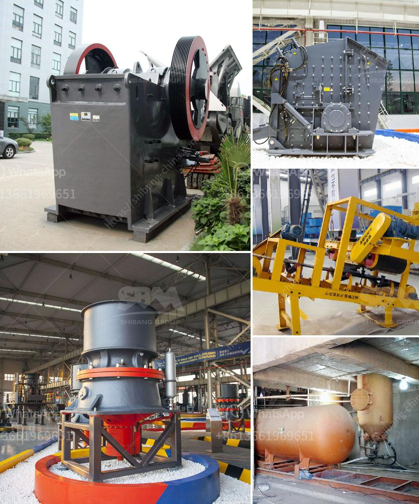

<h3>stone crusher finding</h3>
Stone Crusher is a machine designed to reduce large rocks into smaller rocks, gravel, or rock dust. The earliest crushers were hand-held stones, where the weight of the stone provided a boost to muscle power, used against a stone anvil. Querns and mortars are types of these crushing devices.

The global stone crushing equipment market is anticipated to register a CAGR of about 8% during the forecast period (2020 - 2025). Growing urbanization, increasing population, development of highways and infrastructure, increasing transportation, growing mining activities will contribute to the growth of the stone crushing equipment industry.

Stone crushing equipment market is segmented on the basis of type. The market can be segmented on the basis of product, which includes cone crusher, jaw crusher, impact crusher. The market can be segmented on the basis of end-user, which includes mining, quarrying, recycling, and others. The market can be segmented on the basis of geography, which includes North America, Europe, Asia-Pacific, Middle East & Africa, and Latin America.

Rapid industrialization and urbanization especially in developing countries will drive the growth of stone crushing equipment market. Higher adoption of technology and increased infrastructure development will also contribute to growth. However, there are certain factors that can hinder growth such as the high cost of the machinery and lack of skilled operators.

The stone crusher equipment market is witnessing the emergence of mobile cone crushers that are an ideal solution for secondary crushing operations. Mobility is a key factor for clients who prefer to move their processing units by road. In addition, the cone crusher has a special crushing cavity shape that guarantees better quality of the finished product.

The stone crushing equipment market is characterized by the presence of several major players, and these players actively participate in the growth of the market. The competition in the market is intense and is likely to become more intense in the coming years. Construction and mining equipment usually covers a variety of machinery such as hydraulic excavators, wheel loaders, dump trucks, garbage trucks, and cranes.

The market for stone crushing equipment is expected to witness growth over the next five years. This is due to the rising demand for aggregates in construction and infrastructure projects globally. Furthermore, growing urbanization and industrialization are also contributing to the growth of the stone crushing equipment market. However, factors such as high cost and lack of skilled personnel may hamper the growth of the market.

In conclusion, the stone crusher equipment market is experiencing substantial growth due to the high growth of the construction and mining industries. The market is highly competitive and is expected to become even more competitive in the coming years. Taking into consideration the growing demand for aggregates, urbanization, and industrialization, the stone crushing equipment market is sure to witness significant growth in the future.
<h3>Contact us</h3><ul><li><strong>Whatsapp:&nbsp;<a href="https://wa.me/8613661969651">+8613661969651</a></strong></li><li><a href="https://swt.shibang-china.com/?git&amp;zhl&amp;stone crusher finding"><strong>Online Service(chat now)</strong></a></li></ul><h3>Related</h3><ul><li><a href='ultra fine milling machines.md'>ultra fine milling machines</a></li><li><a href='calcium carbonate process flow diagram.md'>calcium carbonate process flow diagram</a></li><li><a href='rock crusher machine malaysia.md'>rock crusher machine malaysia</a></li><li><a href='used limestone pulverizers crusher for sale texas.md'>used limestone pulverizers crusher for sale texas</a></li><li><a href='vertical grinding mill machine in china.md'>vertical grinding mill machine in china</a></li></ul>