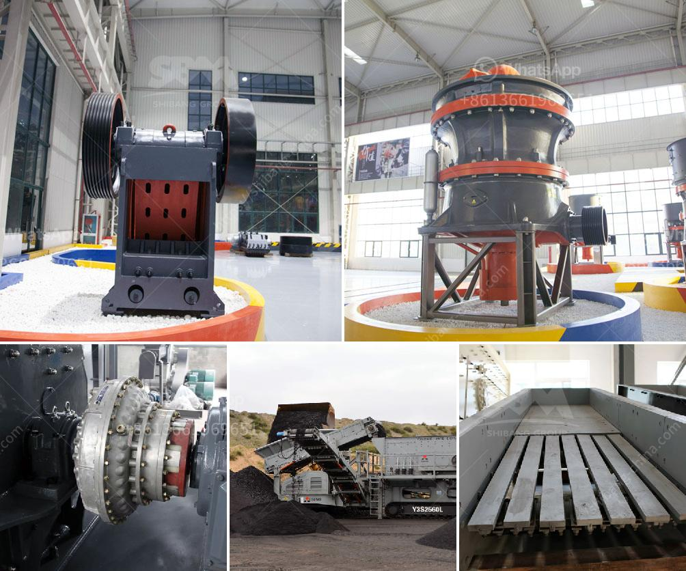

<h3>stone crusher for hire in durban</h3>
In today’s global economy, efficiency and cost-effectiveness are crucial for any business. This requires companies to invest in equipment that can help them save both time and money. One such piece of equipment that can make this possible is a stone crusher.

Stone crushers are used for crushing rocks and hard materials. The stone crusher is portable and can be easily carried on the back of a truck or trailer. It provides flexibility in job sites, reduces the transportation cost, and improves the efficiency of the crushing process.

The potential applications for stone crushers include primary and secondary crushing of aggregates, quarried materials, demolition waste, and even bricks and concrete. With the ease of mobility on job sites, these crushers can be used for both large-scale and small-scale projects.

In Durban, there are many companies specializing in providing stone crusher for hire services. These companies offer a wide range of crusher sizes to meet the needs of various applications. Some of the popular sizes offered include:

1. Portable Mobile Stone Crushers: These are highly mobile and can be easily transported from one job site to another. They can crush stones up to 200mm in diameter and can handle a wide range of materials, such as concrete, stone, and asphalt.

2. Heavy-duty Stone Crushers: These crushers are designed for large-scale applications and can crush stones up to 600mm in diameter. They are ideal for construction projects and can crush materials such as rock, concrete, and stone.

Hiring a stone crusher in Durban has never been easier. With companies offering numerous rental options, choosing the right crusher for your needs can be an overwhelming task. This article will simplify the process by providing a guide on how to choose and hire the right crusher for your job site.

1. Determine Your Needs: The first step is to assess your specific requirements. Consider factors such as the size and type of material to be crushed, the volume of material to be processed, and the desired output size.

2. Research and Comparisons: Once you know your requirements, research various stone crusher rental companies in Durban. Compare their offerings, including the size and capacity of crushers they have available, as well as the terms and conditions of the rental agreement.

3. Seek Recommendations: Reach out to colleagues or industry professionals who have recently hired stone crushers in Durban. Ask for recommendations on reliable and reputable rental companies.

4. Request Quotes: Contact the shortlisted rental companies and request quotes for the desired stone crusher. Compare the prices, terms, and conditions, and select the rental company that offers the best value for money.

5. Inspect and Test: Once you have hired the stone crusher, inspect it thoroughly for any potential damage. Test it on-site to ensure it is working properly and meets your requirements.

In conclusion, hiring a stone crusher in Durban can save significant time and money for your business. When choosing a rental company, ensure you consider your specific needs, compare different options, seek recommendations, and inspect the equipment before use. By following these steps, you can make an informed decision and find the best stone crusher for your next project.
<h3>Contact us</h3><ul><li><strong>Whatsapp:&nbsp;<a href="https://wa.me/8613661969651">+8613661969651</a></strong></li><li><a href="https://swt.shibang-china.com/?git&amp;zhl&amp;stone crusher for hire in durban"><strong>Online Service(chat now)</strong></a></li></ul><h3>Related</h3><ul><li><a href='price of stone crusher.md'>price of stone crusher</a></li><li><a href='stone crusher sri lanka.md'>stone crusher sri lanka</a></li><li><a href='gravel crushing machine in ethiopia.md'>gravel crushing machine in ethiopia</a></li><li><a href='rotary breaker for coal 200tph.md'>rotary breaker for coal 200tph</a></li><li><a href='portable rock crusher for sale.md'>portable rock crusher for sale</a></li></ul>