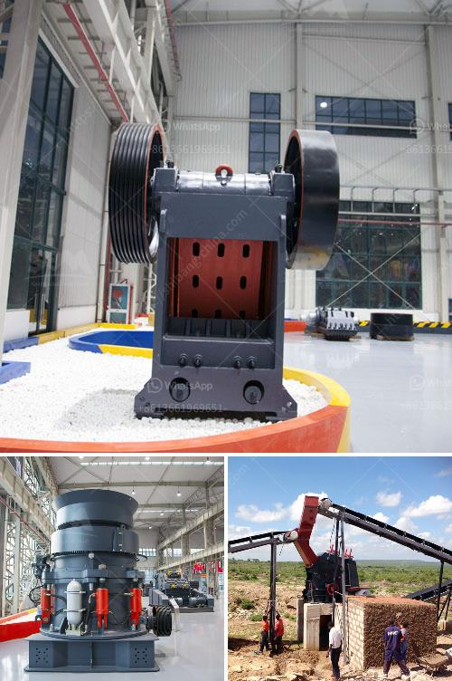

<h3>stone crusher for tractors</h3>
Agriculture fields with acreage ranging from small-scale to large-scale require efficient machines that enable work to be accomplished with ease. Stone crushers are ideal for these types of areas, as they are able to crush stones into gravel and even mulch production for various uses. Whether you need to clear a field, create a road, or construct a building site, a stone crusher for tractors provides the solution.

Stone crushers for tractors between 80 and 220 HP with a max working depth of 20 cm/8''. Designed and built to meet the needs of professional contractors crushing rock up to 30 cm12'' in diameter and to a depth of 20 cm/8'', working on large job sites and agricultural field reclamation with loose and/or shallow rock. These machines are unique in their ability to size and crush stone, making them suitable for a variety of applications.

Stone crushers for tractors are versatile machines that can be used for a wide range of applications. In agriculture, the machines are used to crush stones into gravel and even mulch production, helping farmers to improve productivity and efficiency. Agricultural land sites, golf courses, and forest areas are some of the prime locations where stone crushers are found. These machines also lend themselves well to mining operations, where raw materials need to be crushed to produce aggregates.

When choosing a stone crusher for tractors, it is important to understand its power and durability. The power range of stone crushers for tractors is typically from 80 to 300 horsepower. Having a reliable, agile, and fuel-efficient tractor is key to the productivity and success of any agricultural or construction project.

When operating a stone crusher, the quality of the end product is of paramount importance. Ensuring the desired size of the crushed aggregate, maintaining a consistent grading, and producing a high-quality product is crucial for meeting the market demand.

Stone crushers for tractors come in various sizes and designs, and can be installed in a variety of locations and environments. Ruggedness, durability, and versatility are important features to look for in stone crushing equipment.

Investing in a stone crusher for tractors is a wise choice for busy contractors as it enables them to deliver agri-chaff and services even in remote areas. There are many different models available, ensuring that you will be able to find one that is perfect for your specific needs. With the ability to crush stones of different sizes, you can cater to various project requirements.

Overall, a stone crusher for tractors offers many benefits, whether you need to clear land, create new roadways or even ditches. Investing in this versatile equipment will make your work more efficient, allowing you to finish tasks more quickly and with ease. Be sure to choose the right stone crusher for your needs to ensure its maximum efficiency and overall success.
<h3>Contact us</h3><ul><li><strong>Whatsapp:&nbsp;<a href="https://wa.me/8613661969651">+8613661969651</a></strong></li><li><a href="https://swt.shibang-china.com/?git&amp;zhl&amp;stone crusher for tractors"><strong>Online Service(chat now)</strong></a></li></ul><h3>Related</h3><ul><li><a href='automatic rolling mill manufacturer liberia.md'>automatic rolling mill manufacturer liberia</a></li><li><a href='price of conveyor belts for mining.md'>price of conveyor belts for mining</a></li><li><a href='metal conveyor belts in plates.md'>metal conveyor belts in plates</a></li><li><a href='mtm 70 ball mill how much capacity.md'>mtm 70 ball mill how much capacity</a></li><li><a href='used crusher for sale from iran.md'>used crusher for sale from iran</a></li></ul>