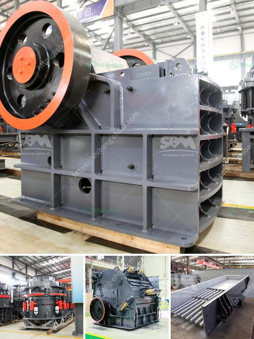

<h3>stone crusher in jos plateau state nigeria</h3>
Stone crusher is the solid mineral processing industry and has the largest population in Jos Plateau State, Nigeria. It is a rural settlement in the Jos Plateau, Nigeria. The area has become known for its rich mineral resources, including tin, columbite, and tantalite. This has attracted many investors and mining companies to the area, leading to the establishment of stone crushing factories.

The stone crusher industry in Jos Plateau State is concentrated mainly in the northern part of the state. The leading crushing companies produce a variety of aggregates used in construction, roads, and railways for building infrastructure. The stone chips produced by these companies are widely used in concrete production as well.

Stone crushing is a major source of employment in the area, especially for the youths. The industry provides both direct and indirect jobs to the residents of Jos Plateau State. Many local residents are employed as laborers in the stone crushing factories, while others are involved in the transportation and marketing of the crushed stones.

Stone crushing is a lucrative business for both the individuals and the government. The stone crusher industry contributes significantly to the economic development of Jos Plateau State. The industry generates revenue through the sale of crushed stones, which are used in various construction projects. The government also benefits from taxes and levies imposed on the stone crushing companies operating in the area.

However, the stone crusher industry in Jos Plateau State is not without its challenges. One of the major challenges faced by the industry is the illegal mining of the minerals that are processed in the stone crushing factories. Illegal miners often invade the mining sites and engage in unregulated mining activities, which pose significant environmental and safety risks.

Another challenge faced by the stone crusher industry is the lack of adequate infrastructure to support the operations of the industry. The current road network in the area is in a poor state, making it difficult to transport the crushed stones to their intended markets. This results in delays and increased transportation costs for the stone crushing companies.

To address these challenges, the government of Jos Plateau State should take proactive measures to regulate and monitor the activities of the stone crusher industry. This includes enforcing stricter regulations on mining activities and providing better infrastructure, such as improved road networks and transportation facilities. The government should also provide training and support to the local residents engaged in stone crushing activities to improve their skills and ensure safe mining practices.

In conclusion, the stone crusher industry in Jos Plateau State, Nigeria, plays a significant role in the economic development of the area. The industry provides employment opportunities and generates revenue for both the individuals and the government. However, it also faces challenges such as illegal mining and inadequate infrastructure. To overcome these challenges, proactive measures are needed from the government to regulate the industry and provide necessary infrastructure support.
<h3>Contact us</h3><ul><li><strong>Whatsapp:&nbsp;<a href="https://wa.me/8613661969651">+8613661969651</a></strong></li><li><a href="https://swt.shibang-china.com/?git&amp;zhl&amp;stone crusher in jos plateau state nigeria"><strong>Online Service(chat now)</strong></a></li></ul><h3>Related</h3><ul><li><a href='new stamp mill for sale in zimbabwe.md'>new stamp mill for sale in zimbabwe</a></li><li><a href='stone crusher cebu for sale in kenya.md'>stone crusher cebu for sale in kenya</a></li><li><a href='roll wheel pulverizer.md'>roll wheel pulverizer</a></li><li><a href='concrete recycling crushing machine.md'>concrete recycling crushing machine</a></li><li><a href='stone crusher machine for sale tanzania.md'>stone crusher machine for sale tanzania</a></li></ul>