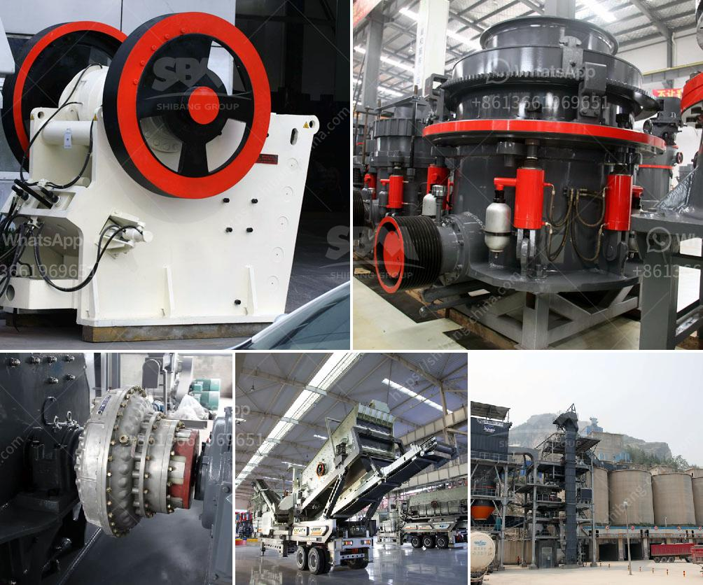

<h3>stone crusher in ksa</h3>
Stone crushers have proved to be essential equipment in mining, construction, and infrastructure projects, contributing to the growth of the country's economy. They are highly effective in crushing different types of stones, such as limestone, granite, marble, and more. In Saudi Arabia, stone crushers have played a vital role in the development of infrastructure over the years.

Saudi Arabia has a thriving construction industry with extensive investment in projects for the development of roads, bridges, and buildings. As part of this growth, there has been a significant rise in the use of stone crushers in the construction sector. These crushers provide residential, commercial, and industrial sectors with a wide range of raw building materials.

Stone crushers are the essential machines in the stone crushing process. Based on years' experience and technology development, stone crushers are developed by adopting domestic and foreign applicable specifications and standards. They are efficient in crushing not only soft rocks but also hard rocks, reducing materials to the required size for various applications, such as road construction, concrete production, and architectural landscaping.

One of the key advantages of stone crushers is their ability to handle a wide range of materials. Various stones with different properties can be crushed by stone crushers, such as limestone, granite, basalt, pebble, marble, and others. Different stone crushers have different crushing capacities, which also suits different production demands.

Stone crushers in Saudi Arabia are professionally designed for crushing and screening materials into high-quality aggregate materials, which provide high-quality construction materials for various applications. In addition, stone crushers are also beneficial to the mining industry due to their ability to break down large pieces of raw material into manageable sizes, making it easier to process minerals.

Furthermore, stone crushers in Saudi Arabia are built to withstand harsh environmental conditions. They operate in a dusty and extreme weather environment, requiring a robust and durable design to ensure their longevity and efficient operation. Stone crushers are often equipped with dust suppression systems to minimize the dust emission and maintain a clean and healthy working environment.

Saudi Arabia is blessed with abundant natural resources, which are the source of raw materials for various construction projects. Stone crushers play a crucial role in modern infrastructure development due to their ability to crush and process natural rocks into high-quality materials. Moreover, stone crushers are significant in supporting the economy of Saudi Arabia by providing readily available aggregates, contributing to the growth of the construction sector.

In conclusion, stone crushers have become a vital part of Saudi Arabia's construction industry. With the country's booming infrastructure, stone crushers and other construction equipment are essential to infrastructure development. Stone crushers have a range of applications, providing high-quality aggregate materials for various sectors. They are built to withstand harsh conditions, making them suitable for the demanding environment in Saudi Arabia.
<h3>Contact us</h3><ul><li><strong>Whatsapp:&nbsp;<a href="https://wa.me/8613661969651">+8613661969651</a></strong></li><li><a href="https://swt.shibang-china.com/?git&amp;zhl&amp;stone crusher in ksa"><strong>Online Service(chat now)</strong></a></li></ul><h3>Related</h3><ul><li><a href='cheap used jaw rock crushers for sale.md'>cheap used jaw rock crushers for sale</a></li><li><a href='stone crusher in oman.md'>stone crusher in oman</a></li><li><a href='vibrating screen for 150 microns.md'>vibrating screen for 150 microns</a></li><li><a href='portable sand screening machine philippines.md'>portable sand screening machine philippines</a></li><li><a href='list of mineral processing plants in oman.md'>list of mineral processing plants in oman</a></li></ul>