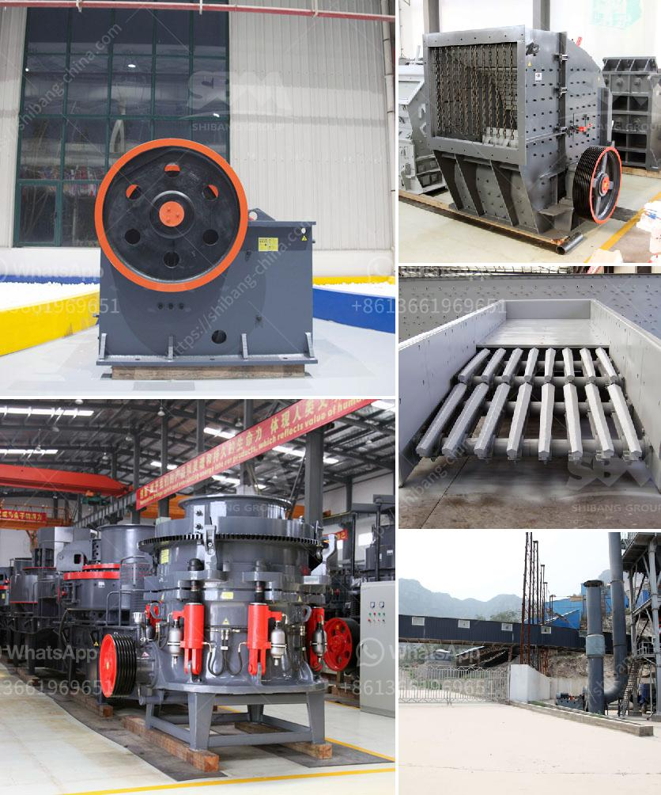

<h3>stone crusher in oman</h3>
Stone crushing industry is an important industrial sector in the country engaged in producing crushed stone of various sizes depending upon the requirement which acts as raw material for various construction activities such as construction of roads, highways, bridges, buildings, canals etc. It is estimated that there are over 12,000 stone crusher units in Oman.

The stone crushing industry sector is estimated to have an annual turnover of around USD 1 billion. Oman has a wide variety of mineral resources. The industry mainly consists of small and medium scale establishments that produce building materials directly from stones or rocks.

Stone crusher is mostly utilized in limestone mining and quarrying company for crushing limestone, rocks, sand stone into making aggregates, sand even powder. Stone crusher in Oman is normally utilized for roading constructing with water conservancy project, light-weight creating supplies industry as well as other sorts of infrastructure projects.

There are numerous varieties of crushers to be chose as stone crusher in Oman. These are majorly located in the eastern part of the country where a majority of the construction activities are taking place. The crushers are equipped with advanced technologies such as automatic control system, high crushing ratio, high efficiency, and low cost.

One of the leading stone crusher manufacturers in Oman is the company Al Duqm Crushers. Al Duqm Crushers is registered with the Ministry of Commerce and Industry, Oman. They are capable of producing 1000 metric tons of crushed stones per month. Prices for various sizes of crushed stones go up to USD 13.50 per metric ton.

OMCO and GSL have established stone crusher plants, which are capable of producing over 2000 metric tons of aggregates per day. These plants are available in various locations in the region, such as Ibri, Sohar, and Salalah.

Stone crushers play a crucial role in the mining industry. In Oman, the government is focusing on increasing infrastructure development investments, which in turn expects an increase in demand for crushed stones in the country. Rapid urbanization has led to the expansion of the construction industry, thus driving the growth of the stone crushing equipment market.

The stone crushing equipment market is anticipated to witness considerable growth in the coming years due to the rise in road construction projects. Additionally, the government initiatives, such as the expansion of airports and exploration of new mines, are expected to propel the demand for stone crushers.

However, stone crushing operations in Oman can adversely impact the environment if not carefully managed. Dust and emissions from these operations can cause respiratory problems and other health issues for workers and nearby communities. Therefore, it is important for stone crusher operators to implement proper dust control measures and adopt sustainable practices.

In conclusion, the stone crusher industry in Oman is growing rapidly due to increasing demand from the construction sector. The government is investing in infrastructure development projects, which is driving the demand for crushed stones. However, it is important for industry players to prioritize environmental sustainability by implementing proper dust control measures.
<h3>Contact us</h3><ul><li><strong>Whatsapp:&nbsp;<a href="https://wa.me/8613661969651">+8613661969651</a></strong></li><li><a href="https://swt.shibang-china.com/?git&amp;zhl&amp;stone crusher in oman"><strong>Online Service(chat now)</strong></a></li></ul><h3>Related</h3><ul><li><a href='concrete crushing machines.md'>concrete crushing machines</a></li><li><a href='price kenya crushers.md'>price kenya crushers</a></li><li><a href='small mobile diesel engine double rolls crusher.md'>small mobile diesel engine double rolls crusher</a></li><li><a href='quartz powder mill shanghaiu.md'>quartz powder mill shanghaiu</a></li><li><a href='used raymond mill for sale.md'>used raymond mill for sale</a></li></ul>