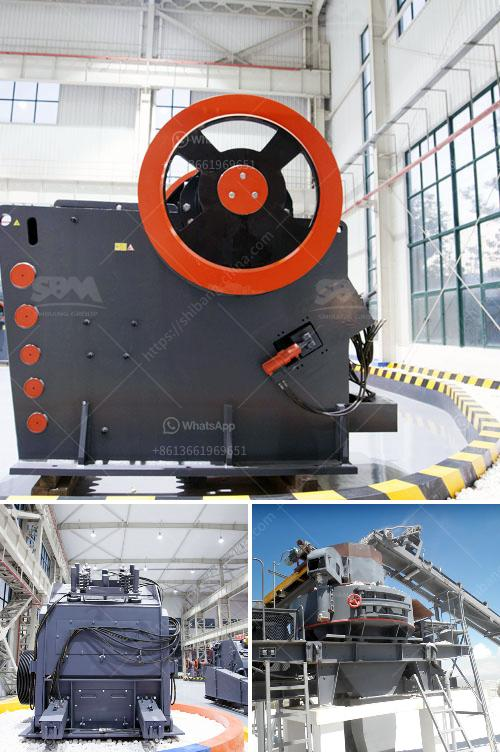

<h3>stone crusher in pakistan</h3>
Stone crushing industry is a dominant but still environmentally unorganized sector in Pakistan. Its different operations cause significant environmental impacts including air and noise pollution in the vicinity as well as vibration effects far-off. A stone crushing plant is primarily involved in the manufacture of aggregates of various sizes (coarse aggregates, crusher run, rock sand and other fine aggregates) from basalt boulders. Coarse aggregates are usually used in ready mix concrete and asphaltic concrete. Crusher run is used for the bases and sub-bases for road making.

Fine aggregates are used for the production of concrete and plastering. The processes involved in stone crushing include pre-processing, crushing, washing, screening, and recycling of wastewater. Stone crushing units also trigger respiratory problems among workers resulting in serious health issues. Prolonged exposure to dust generated by crushing activities can cause lung diseases such as silicosis, cancer and asthma.

As per the World Health Organization (WHO), silicosis is an incurable lung disease caused by inhalation of very fine silica dust, damaging the lung tissues. The dust generated during stone crushing can also cause environmental issues such as land degradation, water pollution and soil erosion.

Pakistan has witnessed a boom in infrastructure development over the past few years and stone crushing industry has played a crucial role in facilitating this development. However, the industry is posing a serious threat to the environment as traditional stone crushing units emit harmful gases and dust.

The unregulated and illegal stone crushing units are hazardous for workers as well as the environment. To curb this issue, various organizations, governmental bodies, and regulatory authorities have attempted to impose restrictions and regulations to control the stone crushing operations.

It is important for stone crushing units in Pakistan to comply with environmental laws to avoid the negative impact on veering towards the brink of environmental disaster. Experts suggest cleaner methods for stone crushing such as the use of water sprinklers to suppress the dust and use of dust collectors to control the emission of dust.

Overall, the stone crushing industry in Pakistan is expected to grow further due to the increase in population, urbanization, and industrialization along with the growth of the construction industry. The sector is projected to generate considerable employment opportunities and contribute to the overall economic development of the country. However, it is vital that the industry operates in a sustainable and environmentally responsible manner to mitigate the adverse effects on human health and the environment.
<h3>Contact us</h3><ul><li><strong>Whatsapp:&nbsp;<a href="https://wa.me/8613661969651">+8613661969651</a></strong></li><li><a href="https://swt.shibang-china.com/?git&amp;zhl&amp;stone crusher in pakistan"><strong>Online Service(chat now)</strong></a></li></ul><h3>Related</h3><ul><li><a href='vail crushing meachine models in pharma.md'>vail crushing meachine models in pharma</a></li><li><a href='charcoal making machine south africa.md'>charcoal making machine south africa</a></li><li><a href='stone crusher in pakistan.md'>stone crusher in pakistan</a></li><li><a href='mobile crusher machine in iran.md'>mobile crusher machine in iran</a></li><li><a href='limestone jaw crushers.md'>limestone jaw crushers</a></li></ul>