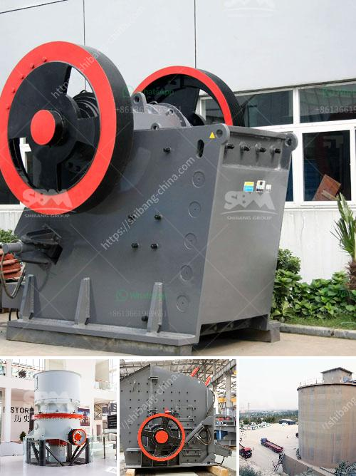

<h3>stone crusher installation cost business</h3>
Stone crushers are commonly used on construction sites and in stone quarries to crush large stones into smaller pieces. Crushed stone has a variety of purposes but is often used to make level surfaces, provide drainage under roads and buildings or to create gravel roads.

Stone crusher installation cost business offers a wide range of stone crushers including jaw crusher, impact crusher, cone crusher, hammer crusher and mobile crusher. These are designed with high crushing ratio and optimum performance in mind. They are suitable for a wide range of applications from mining and quarrying to roadwork and construction projects.

The stone crushing industry is an important industrial sector in the country. There are clusters of stone crushing units located in different parts of the country. The transportation of stone over long distances adds to cost of the crushed stone products, crushers need to be necessarily located nearer to the demand centers such as cities, bridges, canals, etc.

One of the factors that affect the installation cost of stone crushers is distance. For example, jaw crushers are typically deployed in smaller scales to minimize cost. The transport distance between the source of raw material and the destination requires the use of vehicles of various capacities such as trucks and trailers. Cost of transportation is therefore significant in overall project cost for the stone crushing plant.

The installation cost includes the cost of reinforcing steel and concrete materials, labor and the lifting equipment. In addition to the working and idleness costs of the crushing and screening system and the maintenance and repair costs of the equipment, the blasting production and operation costs associated with the machine should be included. Furthermore, the costs of the dust removal system, emissions control system, and the cost of implementing the stone crusher compliance monitoring and enforcement system are also part of the installation cost.

In conclusion, the installation cost of stone crushers is affected by factors such as distance from the source of raw materials, crushing site conditions, labor costs, material costs, and applicable taxes. These factors should be taken into consideration when investing in a stone crusher plant for maximum profits.
<h3>Contact us</h3><ul><li><strong>Whatsapp:&nbsp;<a href="https://wa.me/8613661969651">+8613661969651</a></strong></li><li><a href="https://swt.shibang-china.com/?git&amp;zhl&amp;stone crusher installation cost business"><strong>Online Service(chat now)</strong></a></li></ul><h3>Related</h3><ul><li><a href='indonesia quality crusher conveyor belts.md'>indonesia quality crusher conveyor belts</a></li><li><a href='how to set up a stone quarry company.md'>how to set up a stone quarry company</a></li><li><a href='raymond ultra fine grinding mill.md'>raymond ultra fine grinding mill</a></li><li><a href='copper ore crushing machinery.md'>copper ore crushing machinery</a></li><li><a href='ball mills for sale south africa.md'>ball mills for sale south africa</a></li></ul>