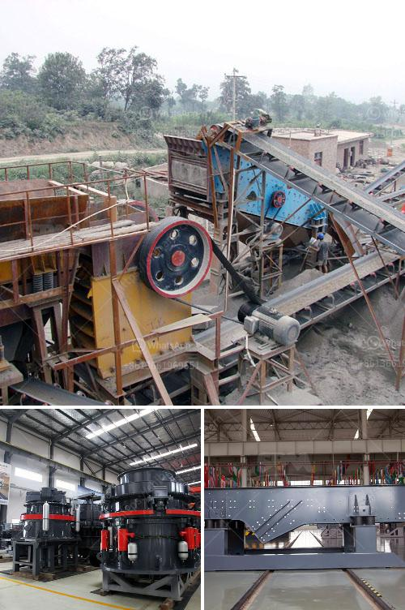

<h3>stone crusher machine company</h3>
With the development of the mining industry, the construction industry and the apparent increase in population, the demand for stone materials is constantly on the rise and stone mining machinery has become an indispensable equipment in the mining machinery industry. The stone crusher machine company is a crucial decision for businesses. When purchasing, they should choose a reputable, high-quality brand, such as the Chinese manufacturer Hongxing Machinery.

Hongxing Machinery, which is headquartered in Henan Province, China, specializes in the production of various types of stone crushers, cone crushers, sand making machines, and other equipment. Hongxing Machinery has always been the primary choice of many well-known enterprises. With its strong technical strength and exquisite craftsmanship, it has won the recognition and praise of customers at home and abroad.

Firstly, the stone crusher machine company has professional technology and excellent quality. The research and development team of the company consists of a group of skilled engineers and technicians who have rich experience and expertise in the mining machinery industry. They continuously explore and innovate, constantly improving the performance and reliability of the crusher machines produced. The production process strictly follows the ISO9001:2015 quality management system standards, and each machine undergoes strict quality inspection before leaving the factory, ensuring that the products are of high quality and reliable.

Secondly, the stone crusher machine company has advanced production technology and equipment. The equipment required for the production of stone materials is mainly composed of crushers, sand making machines, vibrating feeders, vibrating screens, belt conveyors, etc. These equipment are all produced by Hongxing Machinery. The advanced production technology and high-quality raw materials ensure the durability and stability of the equipment. Moreover, the company has introduced advanced technology and equipment from abroad, making the machinery more efficient, energy-saving, and environmentally friendly.

Thirdly, the stone crusher machine company has a good after-sales service system. Hongxing Machinery provides comprehensive pre-sales, in-sales, and after-sales services for customers. They have a professional technical team to provide customers with installation and commissioning services, and they can also train operators for customers. During the warranty period, any quality problems with the machine are free of charge. For long-term cooperation customers, the company also provides regular return visits and maintenance services, effectively solving potential problems and ensuring the normal operation of the equipment.

In conclusion, when choosing a stone crusher machine company, it is necessary to select a reputable, high-quality brand. Hongxing Machinery is a reliable manufacturer committed to providing customers with high-quality machines. It has advanced technology, excellent craftsmanship, and a good after-sales service system. Choosing Hongxing Machinery is choosing a smooth and worry-free production process.
<h3>Contact us</h3><ul><li><strong>Whatsapp:&nbsp;<a href="https://wa.me/8613661969651">+8613661969651</a></strong></li><li><a href="https://swt.shibang-china.com/?git&amp;zhl&amp;stone crusher machine company"><strong>Online Service(chat now)</strong></a></li></ul><h3>Related</h3><ul><li><a href='quarry equipment for hire in nigeria.md'>quarry equipment for hire in nigeria</a></li><li><a href='grinding garnet machine.md'>grinding garnet machine</a></li><li><a href='barite beneficiation plant.md'>barite beneficiation plant</a></li><li><a href='construction of a clinker plant.md'>construction of a clinker plant</a></li><li><a href='used dolomite jaw crusher price malaysia.md'>used dolomite jaw crusher price malaysia</a></li></ul>