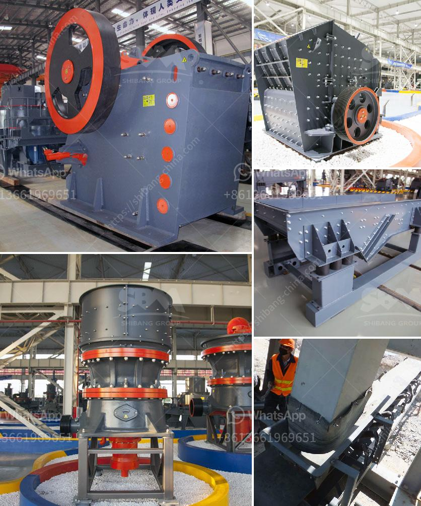

<h3>stone crusher machine for sale in ethiopia</h3>
Stone crusher machine is widely used in mining industry nowadays. Our company has introduced advanced technology from abroad to manufacture a world class high efficiency stone crusher machine. This stone crusher machine has high power that can crush any kind of stones within seconds. Popular for its outstanding features, the offered product is available at a competitive price.

The machine can be used to crush a variety of stones such as granite, marble, limestone, basalt and more. It is widely used in mining, metallurgy, construction, highway, railway, water conservancy and chemical industries.

Different models of this machine can crush stones with different capacity and particle size according to the client’s request.

It has a dual function of coarse and medium crushing. Its large feed opening facilitates the crushing process.

The wear resistant parts of the machine are made of quality materials that prolong the machine’s service life and reduce maintenance costs.

The machine’s design is compact and light, making it highly portable and easy to mount on a variety of different machines.

It has a high crushing ratio which means it can produce more fine particles. This makes it perfect for applications where fine crushing is required.

The machine is designed with a hydraulic system which ensures the ease of maintenance and adjustment of the machine’s parts.

Ethiopia is one of the fastest growing economies in Africa. This landlocked country has seen significant growth in the construction industry, which contributes heavily to the country’s GDP. Ethiopia has embarked on various infrastructure projects, including roads, railways and power plants, which are driving the demand for construction equipment and machinery, including stone crusher machines.

In the past few years, the stone crusher machine market in Ethiopia has been experiencing a huge growth rate due to the significant expansion of infrastructure construction. With the increase in government investment in infrastructure, housing construction, road construction and other industries, the demand for stone crusher machines in the country has reached its peak.

Our company, with manufacturing facilities in China, has been supplying a large number of stone crushing machines to Ethiopia in recent years. We have a team of engineers and technicians capable of designing and manufacturing high quality stone crushing machines, so we have been able to offer a wide range of innovative and advanced stone crushers which are being installed across various locations in Ethiopia.

Our stone crusher machines are suitable for crushing stones ranging in hardness from granite, basalt, limestone to quartzite, marble, etc. In addition to being highly efficient, our stone crushers facilitates low operation and maintenance costs, less downtime and long service life.

In conclusion, the stone crusher machine for sale in Ethiopia has been relied upon in the construction industry for many years now. The machine is an essential part of many infrastructure projects, and is used to crush all kinds of stones and rocks. It is versatile and can be used for both primary and secondary crushing. With the continuous development of the country’s infrastructure, there will be more opportunities for the stone crusher machine industry in Ethiopia.
<h3>Contact us</h3><ul><li><strong>Whatsapp:&nbsp;<a href="https://wa.me/8613661969651">+8613661969651</a></strong></li><li><a href="https://swt.shibang-china.com/?git&amp;zhl&amp;stone crusher machine for sale in ethiopia"><strong>Online Service(chat now)</strong></a></li></ul><h3>Related</h3><ul><li><a href='prices for stone crusher plant.md'>prices for stone crusher plant</a></li><li><a href='price of world largest stone crushing plant.md'>price of world largest stone crushing plant</a></li><li><a href='limestone price in pakistan.md'>limestone price in pakistan</a></li><li><a href='list of mineral processing plants in oman.md'>list of mineral processing plants in oman</a></li><li><a href='gypsum board thailand manufacturer.md'>gypsum board thailand manufacturer</a></li></ul>