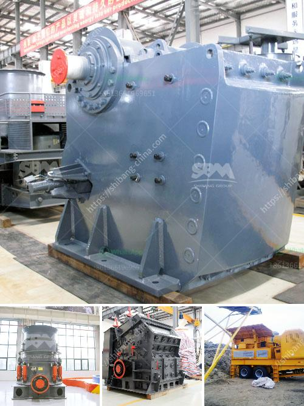

<h3>stone crusher machine for sale kenya</h3>
Stone crusher machine is the necessary equipment mining crushing machinery, the main stone crushers produced by our company include jaw crusher, cone crusher, impact crusher,cone crusher, roll crusher, mobile crusher, etc.

The stone crusher machines are essential equipment in mining machinery, crushing the stone to meet the required size. I believe that through the above specific introduction, users have understood how these four crushing stations crushing of a stone. As a common type of crusher machine, stone crusher has been applied for a long time. However, due to various factors, stone crusher machine still has some disadvantages, such as large raw materials can not be crushed directly without primary crushing.

To improve the comprehensive usage efficiency of the crushing system and increase its flexibility, the grinding system is mainly affected by the type of crusher and mill. The main machine is a small jaw crusher, a hammer crusher, an impact crusher, or a cone crusher for crushing the crushed materials.

In addition, there are many types of auxiliary equipment, such as belt conveyors, feeders, vibrating screens, and multi-purpose machines. The machine includes a dust removal and noise reduction device that matches the environmental protection treatment requirements specified in the construction waste disposal plan.

The stone crusher machine for sale in Kenya is divided into many types. For example, jaw crusher, cone crusher, impact crusher, mobile crusher and so on. The stone crusher prices vary from hundreds of thousands to millions with different types and specifications, so the prices aresimilar, but if you want to know more about the prices, you can contact online customer service for details.

As a professional manufacturer of stone crusher equipment, we have the first-class technology and service level, and our stone crusher machine have been exported to many countries, such as India, South Africa, Tanzania, Nigeria, Mongolia, Kenya, UAE, Botswana, Zambia, Pakistan, etc.
<h3>Contact us</h3><ul><li><strong>Whatsapp:&nbsp;<a href="https://wa.me/8613661969651">+8613661969651</a></strong></li><li><a href="https://swt.shibang-china.com/?git&amp;zhl&amp;stone crusher machine for sale kenya"><strong>Online Service(chat now)</strong></a></li></ul><h3>Related</h3><ul><li><a href='talc grinding machine manufacturer from uzbekistan.md'>talc grinding machine manufacturer from uzbekistan</a></li><li><a href='copper concentrate mobile crusher.md'>copper concentrate mobile crusher</a></li><li><a href='cement plant limestone crusher details.md'>cement plant limestone crusher details</a></li><li><a href='stone crusher plant in maharashtra.md'>stone crusher plant in maharashtra</a></li><li><a href='cost of vertical raw mill.md'>cost of vertical raw mill</a></li></ul>