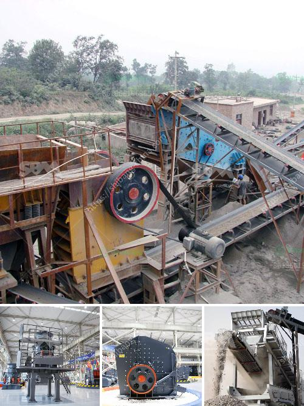

<h3>stone crusher machine in zimbabwe</h3>
Stone crusher machine plays an important role in the stone production line , determines the final product quality and the production benefit, So choose a good crusher is particularly important. Through this stone crushing pant project report, to give you some advice on how to select suitable crushing machine.

There are a variety of crushers in the market , but if you want to choose the right one, we must first understand the scope of the various crusher . The most common machine in the stone crushing plant are jaw crusher and cone crusher , because they provide excellent performance and low price.

Many stone crushing equipment suppliers provide second hand stone crushing machine with low price for sale in Europe, Africa and Asia etc. Theused machinery is with low price and excellent performance, also with long life after sale service. It is the best choice for small or temporary crushing projects.

SBM is world leading stone crusher manufacturer; we also customize crushing solution according to customers' requirements. Please contact us, we will analyze your needs and design a best solution for you.

There are countlesscrusher machine manufacturers around the world. However, Not all manufacturers are reliable. Some manufacturers have high machines' prices, and some manufacturers do not have high quality equipments. They can not be called reliable suppliers. In any case, you should choose a professional stone crushing machine suppliers from numerous mining machinery manufacturer. So far, Aimix has done stone crushing business for more than 30 years. And it can supply customers from all over the world with the following equipments: jaw crusher, impact crusher, cone crusher, gravel crusher, sand making production line, sand making machine, mobile crushing plant, vibrating screen, and so on. Besides, Our products have been delivered to more than 60 countries, such as Algeria, Australia, Bhutan, Bolivia, Brazil, Cambodia, Congo, Egypt, France, India and so on. Therefore, if you want to know about stone crusher machine, leave your comment below and we will contact you soon.

There are so many different types of stone crusher machines in the market for one specific need. Some machines are able to grind or crush huge rocks or ores into smaller pieces. The main types of stone crushers are cone crusher, jaw crusher, impact crusher, and mobile rock crushing. We supply cost-effective products and first-class service, solutions, support for customers. Our factory has an area of 10000 square meters, USD 1000 million fixed assets, and the engineer and technical personnel covering 15% of the total staff. To build a factory for the production and export of China's top mining machinery is our goal.

SBM is sincerely willing to cooperate with you to seize the market opportunity. We will help customers solve problems, provide technical support and assistance before, during and after the sale, and have a good reputation in the customer's mind. As a professional Chinese crushing equipment supplier with rich experience in production line design, the company has CP series multi-cylinder hydraulic cone crusher, PF series impact crusher, etc. up to now, the company's machines have been export to more than 80 countries, such as, Zimbabwe, Kenya, Tanzania, Nigeria, Ethiopia, South Africa, Egypt, Saudi Arabia, Philippines, Indonesia, Mexico, Brazil, and other countries. So please choose a reliable crushing equipment manufacturer for your upcoming project in Zimbabwe.
<h3>Contact us</h3><ul><li><strong>Whatsapp:&nbsp;<a href="https://wa.me/8613661969651">+8613661969651</a></strong></li><li><a href="https://swt.shibang-china.com/?git&amp;zhl&amp;stone crusher machine in zimbabwe"><strong>Online Service(chat now)</strong></a></li></ul><h3>Related</h3><ul><li><a href='crushed sand manufacturing.md'>crushed sand manufacturing</a></li><li><a href='clay graphite grinding process.md'>clay graphite grinding process</a></li><li><a href='demolition plants crushers in lima.md'>demolition plants crushers in lima</a></li><li><a href='price of stone crusher.md'>price of stone crusher</a></li><li><a href='talcum powder philling machine.md'>talcum powder philling machine</a></li></ul>