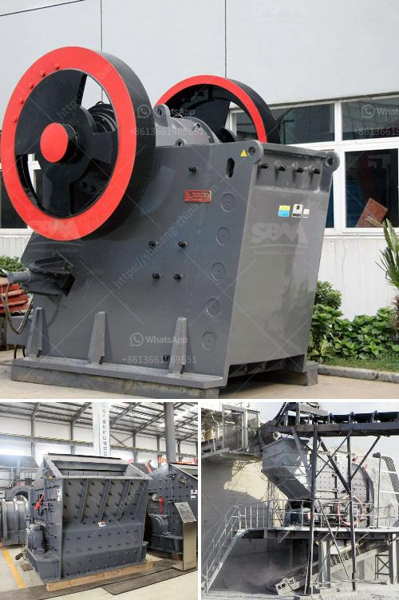

<h3>stone crusher manufacturers in mumbai</h3>
Stone crushing industry is an important industrial sector in the country. The crushed stone is then used as raw material for various construction activities i.e. construction of roads, bridges, buildings and canals. Over the last 10 years, the Construction sector has been registering strong growth rates in the range of 7-8%. Consequently, there is an urgent need to modernize and expand the existing infrastructure to meet the rising demand for residential and commercial buildings, roads, bridges, highways and other infrastructural works.

Stone crushing units are not stand-alone crushing units, but stone mining is also associated with this activity. According to State Pollution Control Board (SPCB), there are about 150 stone crushing units operating in and around Mumbai alone, which generate considerable amount of air pollution and dust particles.

It is interesting to note that the proposed project of stone crushing plant by incorporating the crusher for stone and sand is to contribute about 60% of overall production within the economy. Nowadays, the stone crusher manufacturers in Mumbai with a strong presence not only in Maharashtra but also in other regions of India has continuously increasing exports to countries like Qatar, Bahrain and Oman.

The stone crushing machinery offered by these manufacturers are dependable and have a long operational life. These manufacturers can be relied upon as they offer accurate size reduction techniques that are vital to passing the desired rates of fines and coarse ores. These advanced machines with hydraulic adjustment feature can alleviate the difficulty of adjusting the particle size of the final products.

Stone crusher machines are used for crushing stones in crushing plant. SCM offer jaw crusher, mobile crusher, screen for sale for crushing in UAE. About Tahmas Machinery and Spare Parts LLC Tahmas Machinery was established in 2002 and deals with trading of stone the stone crushing industrial sector in U.A.E.

There is added strength to the facility at Mumbai to manufacture Crushing equipment since 2007. Morocco, Tanzania, Sudan are some of the countries where supplied installed plants and are successfully working. Nearly 10 years of experience in the field of stone crushing machinery and equipment as manufacturer, supplier and exporter of Jaw Crusher, Stone Crusher, Screen, and Feeder.

The objective behind the establishment of the company is to cater to the ever-growing construction industry in the region. The company will provide stone crushing machinery and machinery parts used in construction of roads, bridges, buildings and canals.

These stone crushing machines are quite suitable for use in mining, metallurgical industry, road building, construction, chemical industry and other fields. In addition to Jaw crushers, we also offer vibrating screens, vibrating feeders, magnetic separators and mobile crushing plants, etc. These mining machines are good in quality and reasonable in prices. Jaw crusher is a kind of heavy duty machine which can crush materials into even granularity.

Star Trace is a professional Jaw Crusher manufacturer in India, which adopts advanced manufacturing equipment and technology to produce various crushing machines. Our jaw crushers are convenient to operate and are of reliable performance. These stone crushing machines are quite suitable for use in mining, metallurgical industry, road building, construction, chemical industry and other fields.
<h3>Contact us</h3><ul><li><strong>Whatsapp:&nbsp;<a href="https://wa.me/8613661969651">+8613661969651</a></strong></li><li><a href="https://swt.shibang-china.com/?git&amp;zhl&amp;stone crusher manufacturers in mumbai"><strong>Online Service(chat now)</strong></a></li></ul><h3>Related</h3><ul><li><a href='sand washing machine.md'>sand washing machine</a></li><li><a href='floatation equipment for mining for sale in south africa.md'>floatation equipment for mining for sale in south africa</a></li><li><a href='gypsum production plant.md'>gypsum production plant</a></li><li><a href='silica sand stone machine china.md'>silica sand stone machine china</a></li><li><a href='limestone crushers in ghana.md'>limestone crushers in ghana</a></li></ul>