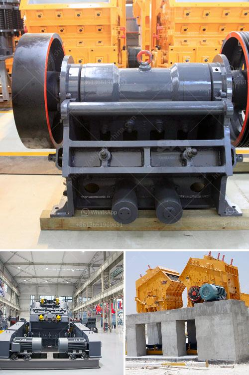

<h3>stone crusher owners of khurda</h3>
Stone crushing is one of the major drivers of rampant deforestation in Khurda district of Odisha, India. It is a process of breaking down larger rocks into smaller pieces, resulting in the release of smaller particles, known as stone dust, which is highly detrimental to the environment. The mountains of Khurda are full of granite stones that are ideal for crushing purposes. Therefore, stone crusher owners have turned their attention towards this district, and converted it into a bustling hub of their business.

The stone crushers are highly beneficial for obtaining quarry materials, which are used for building purposes. They are also supplying crushed stones to the construction industry to cater to various construction projects. However, this flourishing industry has come at a cost to the environment.

The stone crushing units in Khurda district generate unhealthy amounts of dust and noise. This not only poses a serious health risk to the workers and nearby residents but also affects the quality of air and water in the surrounding areas. The stone dust emitted during the crushing process settles on nearby plants and crops, hampering their growth and reducing agricultural productivity.

Apart from the environmental impact, the stone crusher owners of Khurda have also been accused of illegal mining activities. Many of them are extracting stones without proper permits and licenses, causing huge losses to the government treasury. Moreover, the over-exploitation of natural resources is leading to the depletion of these valuable stones, ultimately affecting their availability and driving the prices up.

Efforts have been made by the government and environmental activists to regulate this industry, imposing stricter rules and regulations. However, the stone crusher owners often find ways to evade these laws, resulting in minimal impact on their operations.

To address these issues effectively, there needs to be a collaborative effort between the government, stone crusher owners, and environmental activists. Strict monitoring of these stone crushing units is necessary to ensure adherence to regulations. Additionally, alternative sources of construction materials should be explored to reduce the dependency on stone quarrying.

In conclusion, while stone crushing units may contribute to the economy by supplying materials for construction, the adverse environmental effects cannot be ignored. Therefore, it is crucial to find a balance between economic development and environmental preservation in Khurda district. Only through collective efforts can we mitigate the damage caused by stone crushing and ensure sustainable development for future generations.
<h3>Contact us</h3><ul><li><strong>Whatsapp:&nbsp;<a href="https://wa.me/8613661969651">+8613661969651</a></strong></li><li><a href="https://swt.shibang-china.com/?git&amp;zhl&amp;stone crusher owners of khurda"><strong>Online Service(chat now)</strong></a></li></ul><h3>Related</h3><ul><li><a href='marble processing plant.md'>marble processing plant</a></li><li><a href='coarse powder grinding mill.md'>coarse powder grinding mill</a></li><li><a href='used gold mining equipment for sale in south africa.md'>used gold mining equipment for sale in south africa</a></li><li><a href='automatic rolling mill manufacturer liberia.md'>automatic rolling mill manufacturer liberia</a></li><li><a href='5hp industrial crusher mill.md'>5hp industrial crusher mill</a></li></ul>