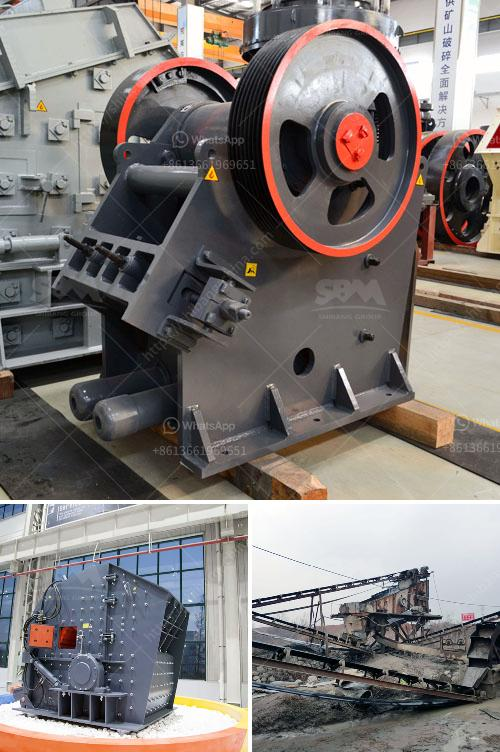

<h3>stone crusher plan dwg</h3>
Stone crushing, as its name suggests, is the process of breaking down large stones into smaller pieces. Many industries use stone crushers to reduce the size of stones. The stone crusher plan dwg has become a hot topic in the mining industry due to its wide application.

The stone crusher plant is used for producing sand, rock and stone for construction, highway, railway and other applications. Fote Heavy Machinery, with 40 years of experience in the stone crushing production line, is skilled in the production line process design and has a high-cost performance.

Fote stone crusher plant and stone crushing equipment have been sold to hundreds of countries, such as India, Pakistan, Indonesia, Nigeria, Kenya, the USA, Ghana, Zimbabwe, Nepal, Philippines, the UK, Vietnam, Iceland, Canada, etc. Is stone crusher plant a profitable business？ 

Gradually exhausted natural sand and gravel resources are clearly unable to meet the growing demand for various construction sands. Therefore, investing in a stone crusher plant can be a good choice. However, certain factors need to be considered in order to ensure that the investment is appropriate for the business.

1. The investment cost of a stone crusher plant is not fixed, which includes transportation, personnel, machinery, license, government, and other costs. 

2. The processing of the stones in the plant includes feeding, crushing, and screening. These three basic processes generally form a complete stone crusher plant. This is a solution based on the customer's requirements.

3. Sometimes, materials with size larger than the maximum feeding size of the crusher will be broken into small pieces due to the obstruction of the discharge port. In this case, the user needs to clean the blocking material in time and then restart the crushing equipment.

The stone crusher plant is a series machine to crush and screen various stone materials. Users can use various configurations according to the types of raw materials, the size and the requirements of finished materials. Nowadays, with the increasing steps of urbanization, construction waste is growing. So, stone crushing plant is the best choice for producing artificial sand and building aggregates.

The process flow of a stone crushing plant is like a circle of sand stones, which can further be divided into rock crushing plant and sand making production line. Different classification leads to different equipment configuration for the production line.

Stone crushing plant can be divided into rock crushing plant and sand making production line. Different classification leads to different equipment configuration for the production line.

Stone crushing plant displays, and graphic illustrations of its stone crusher dwg are prime examples of the understated style and quality of the cone crushing plant dwg. Great Wall Heavy Industry Machinery Company is a professional manufacturer of stone crusher plant with 40 years of production experience and quality assurance.

The stone crusher plant of our company mainly consists of vibrating feeder, jaw crusher, cone crusher or impact crusher, vibrating screen, belt conveyors and control system, etc. It is completely capable to crush and screen limestone, marble, granite, basalt, river stone and so on, and produce sand & gravels with various granularities for construction and building industry. We are able to design and manufacture complete crusher plants with capacity from 30tph to 500tph, and to provide optimum and most economical solutions according to customers' requirements on stone specifications, output, application, etc.

In conclusion, the stone crusher plant is a profitable business that has existed for decades. It has been proven that the stone crusher plant not only increases the efficiency and production capacity of stone crushing, but also has an important economic benefit to the business owner. Due to its wide application field, stone crusher plant is more and more popular nowadays.
<h3>Contact us</h3><ul><li><strong>Whatsapp:&nbsp;<a href="https://wa.me/8613661969651">+8613661969651</a></strong></li><li><a href="https://swt.shibang-china.com/?git&amp;zhl&amp;stone crusher plan dwg"><strong>Online Service(chat now)</strong></a></li></ul><h3>Related</h3><ul><li><a href='methods of hammer mill.md'>methods of hammer mill</a></li><li><a href='renting of screens and crushers in middelburg.md'>renting of screens and crushers in middelburg</a></li><li><a href='how much does it cost per day to run a gold mine.md'>how much does it cost per day to run a gold mine</a></li><li><a href='crusher equipment manufacturer.md'>crusher equipment manufacturer</a></li><li><a href='vertical grinding mill machine in china.md'>vertical grinding mill machine in china</a></li></ul>