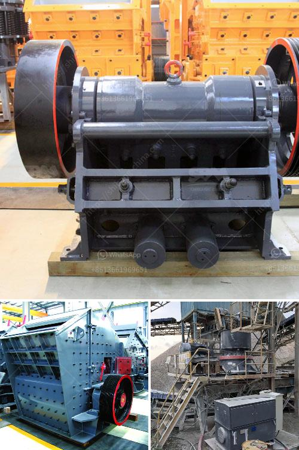

<h3>stone crusher plant in maharashtra</h3>
Stone crushing plants in Maharashtra, commonly known as rock crushing plants, are essential for the production of sand, stone and other materials in various industries. With the increasing demand of stone and aggregate materials in construction and infrastructure projects, the market for stone crushing plants is booming in Maharashtra.

In recent years, the government has been working on infrastructure projects across the state, which has led to a high demand for stone and aggregate materials. This has prompted stone crusher manufacturers to invest in the corresponding infrastructure to ensure smooth operation and expand production capacity.

A stone crusher plant is a profitable venture for new entrepreneurs. The demand for quality stone chips is increasing day-by-day. The market for crusher plants is expanding in recent years and will continue to grow in the future. It is estimated that the market for stone crushing plants will reach around 300-500tph in 2022.

The mining industry in Maharashtra is one of the fastest-growing industries in the state. Stone crushing is an important part in mining industry and require high quality stone crushing machines in Maharashtra. Stone crushing machinery is widely used by the mining companies; they are installed near the sites. The purpose of installing these crushing machines near to the site or in some cases just in front of mining entrance is to ensure hassle free transportation of the mineral from the mine to the crusher and finally the end products can be used in construction industry, roads and highways, and various other projects.

With the increasing need of stone and aggregate materials in construction projects, the demand for stone crushing plants is increasing in Maharashtra. Mining industry in Maharashtra is also growing. With the growing population and increasing urbanization, the demand for stone and aggregate materials is rising. This provides opportunities for new entrepreneurs to invest in stone crushing plants.

Stone crushing business has a huge potential for growth and opportunities for investment. Maharashtra, located in the Western Ghats of India, is a growing economy with a booming construction industry. The stone crushing industry sector is estimated to have an annual turnover of around Rs. 5000 crore. With increasing regulation and ongoing infrastructural projects, the future is promising for the stone crushing industry.

With demand booming, many projects are being awarded in railway, roads, bridges, ports, and smart cities, etc. Anju Choudhary Stone Crushers has bagged a part order of supply of railway ballast to a new connecting railway line between Jabalpur to Nagpur and surrounding area. The new station in Nainpur, which is 15 kms from the Anju Choudhary crushing plant, made it easy for timely completion of the project.

The Brihanmumbai Municipal Corporation (BMC) recently announced the allocation of Rs. 5 crore to set up a new paper recycling plant at a Dharavi godown. This initiative is aimed at reducing the city's solid waste and ensuring effective waste management. Stone crushing plants can be used in quarry sites, mining, recycling and construction waste disposal, etc.

According to the government's market research, the demand for stone crushing machinery is projected to grow steadily in the coming years. To meet the growing demand for aggregate materials, stone crusher plants are being set up near the construction sites and also in and around the residential areas.

Stone crushers are very rare and effective medicine (best treatment for kidney stones) made from precious herbs, which have proved to be effective in extracting kidney stones up to 20 mm. The first volume of this drug starts affecting the kidney stone. Consumption method: - There are 4 doses in a box of Stone Crushers, it has to be eaten for 4 days regularly, for which every dose has to eat on 3 adults (large size) leaves of Bryophyllum pinnatum (Pattharchatta) in the morning on empty stomach. After taking this medicine do not eat any type of food for 1 to 2 hours, can set with plain water preferably warm water. Consumption method: - There are 4 doses in a box of Stone Crushers, it has to be eaten for 4 days regularly, for which every dose has to eat on 3 adults (large size) leaves of Bryophyllum pinnatum (Pattharchatta) in the morning on empty stomach. After taking this medicine do not eat any type of food for 1 to 2 hours, can set with plain water preferably warm water.

In conclusion, stone crusher plants are essential for the production of sand, rock, and other materials in various industries. The increasing demand for stone chips is a testimony to the fact that the market for crusher plants is healthy and growing. With increasing regulation and ongoing infrastructural projects, stone crusher manufacturers in Maharashtra are ready to cater to the growing demands of the market.
<h3>Contact us</h3><ul><li><strong>Whatsapp:&nbsp;<a href="https://wa.me/8613661969651">+8613661969651</a></strong></li><li><a href="https://swt.shibang-china.com/?git&amp;zhl&amp;stone crusher plant in maharashtra"><strong>Online Service(chat now)</strong></a></li></ul><h3>Related</h3><ul><li><a href='project report of grinding mill.md'>project report of grinding mill</a></li><li><a href='limestone crusher secondary machine price.md'>limestone crusher secondary machine price</a></li><li><a href='crusher on rent in india.md'>crusher on rent in india</a></li><li><a href='stone crusher sri lanka.md'>stone crusher sri lanka</a></li><li><a href='dolomite stone crusher plant cost.md'>dolomite stone crusher plant cost</a></li></ul>