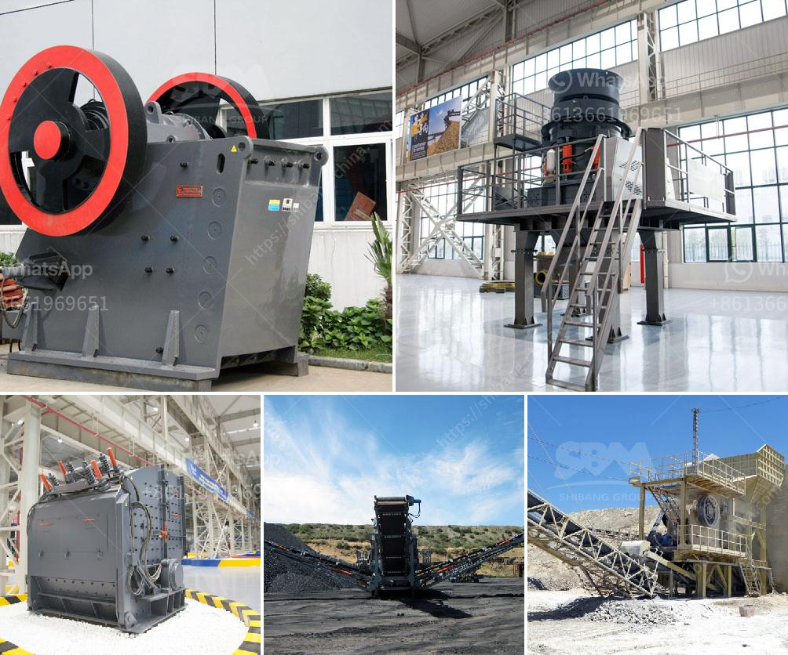

<h3>stone crusher plant in uae</h3>
Stone crushing plants are used in many industries for processing materials into smaller pieces. They are necessary equipment in construction, mining, and various other industries.

Stone crusher plants in UAE, also known as stone crushing plants, are used for crushing stones into small pieces to produce dust and sand. This is a common material for many construction projects and companies. We have the capability to design and manufacture stone crusher plants up to a capacity of 500 tons per hour. Our plants are characterized by high quality, high productivity, and competitiveness.

Different stones from different sources have different characteristics. For example, limestone, granite, and basalt are medium hard stones, while river stone, marble, and pebbles are relatively soft. Different stone crushing plants have different crushing capacities, so their specifications and requirements for the finished products also vary. In general, stone crushing plants can be divided into fixed crushing plants and mobile crushing plants.

Fixed crushing plants are designed and installed for permanent use. They consist of crushers, conveyors, screens, and control rooms. They are typically located near the source of material, such as quarry sites, sand and gravel pits, or construction sites. Fixed crushing plants require a large area for installation and have higher initial costs.

Mobile crushing plants, on the other hand, are designed to be moved easily and quickly from one location to another. They are suitable for short-term projects or to be used as a backup in case the primary crushing plant is not available. Mobile crushing plants are compact and can be transported as a single unit on the road. They have lower costs, require less space, and can be used in various locations.

In conclusion, stone crusher plants in UAE are essential equipment in many industries for processing materials into smaller pieces. They are widely used in construction, mining, and various other industries. We provide high-quality stone crushing plants with competitive prices and excellent service.
<h3>Contact us</h3><ul><li><strong>Whatsapp:&nbsp;<a href="https://wa.me/8613661969651">+8613661969651</a></strong></li><li><a href="https://swt.shibang-china.com/?git&amp;zhl&amp;stone crusher plant in uae"><strong>Online Service(chat now)</strong></a></li></ul><h3>Related</h3><ul><li><a href='ball milling method.md'>ball milling method</a></li><li><a href='jaw crusher vs gyratory crusher stone crusher quarry.md'>jaw crusher vs gyratory crusher stone crusher quarry</a></li><li><a href='to set up a stone crushing plant in bhutan.md'>to set up a stone crushing plant in bhutan</a></li><li><a href='quarry equipment for hire in nigeria.md'>quarry equipment for hire in nigeria</a></li><li><a href='crusher plants for sale in pakistan.md'>crusher plants for sale in pakistan</a></li></ul>