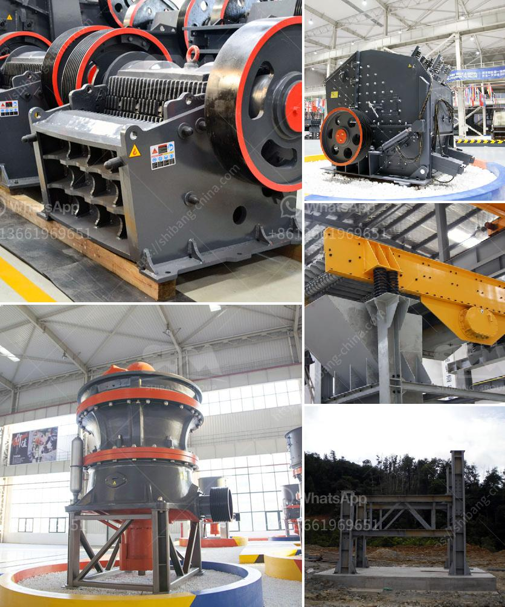

<h3>stone crusher plant kyc</h3>
In today's fast-paced industrialized world, construction projects are everywhere. Buildings, roads, and other infrastructure have become more prevalent, requiring the need for efficient equipment to handle the extensive workload. Among the most essential machinery in any construction site is a stone crusher plant. These are unique and versatile machines that crush stones into smaller sizes, suitable for various applications.

One of the striking features of a stone crusher plant KYC (Know Your Customer) is its ability to enhance the overall efficiency and productivity of any construction project. This highly automated plant ensures that stones are consistently crushed and processed into the desired output size, making it an ideal choice for any construction site.

The stone crusher plant KYC performs numerous tasks, such as crushing large rocks into smaller rocks, gravel, or rock dust. This machine utilizes a heavy-duty rotor mechanism that reduces the size of the stone into manageable sizes. The rugged steel construction ensures durability for prolonged use and can withstand the harsh conditions often encountered in construction sites.

Another advantage of the KYC stone crusher plant is its automated operation. The machine is equipped with advanced sensors and controls, allowing it to function without constant human supervision. This automation minimizes the risk of human errors and improves safety on the construction site. Additionally, the automation enables consistent and efficient crushing, saving time and resources.

With a wide range of applications, the stone crusher plant KYC is suitable for various construction projects. From road and bridge construction to building foundations and landscaping works, this plant can handle different materials, including granite, limestone, concrete, and more. The versatility of this machine ensures that it can cater to the diverse needs and requirements of every construction site.

Moreover, the KYC stone crusher plant is designed to be environmentally friendly. The machine comes with an advanced dust suppression system that minimizes the release of harmful particles into the air. This feature not only protects the health and well-being of workers but also ensures compliance with environmental regulations.

In addition to its impressive capabilities, the stone crusher plant KYC also offers ease of transportation and assembly. The plant can be easily relocated to different construction sites, allowing contractors to maximize its utilization. Furthermore, the assembly process is straightforward, saving time and effort.

In conclusion, the stone crusher plant KYC is a unique and versatile machine that plays a crucial role in the construction industry. Its automated operation and efficient crushing capabilities enhance productivity on any construction site. With its wide range of applications, this plant caters to the diverse needs of various construction projects. Moreover, its environmentally friendly features ensure compliance with strict regulations. With its ease of transportation and assembly, the KYC stone crusher plant is a reliable choice for any construction company seeking optimum performance and efficiency.
<h3>Contact us</h3><ul><li><strong>Whatsapp:&nbsp;<a href="https://wa.me/8613661969651">+8613661969651</a></strong></li><li><a href="https://swt.shibang-china.com/?git&amp;zhl&amp;stone crusher plant kyc"><strong>Online Service(chat now)</strong></a></li></ul><h3>Related</h3><ul><li><a href='roller crusher machine manufacturer.md'>roller crusher machine manufacturer</a></li><li><a href='mobile crusher triman.md'>mobile crusher triman</a></li><li><a href='nigeria grinding mill.md'>nigeria grinding mill</a></li><li><a href='zevith simple stone crushers kenya.md'>zevith simple stone crushers kenya</a></li><li><a href='used quarry crusher for sale.md'>used quarry crusher for sale</a></li></ul>