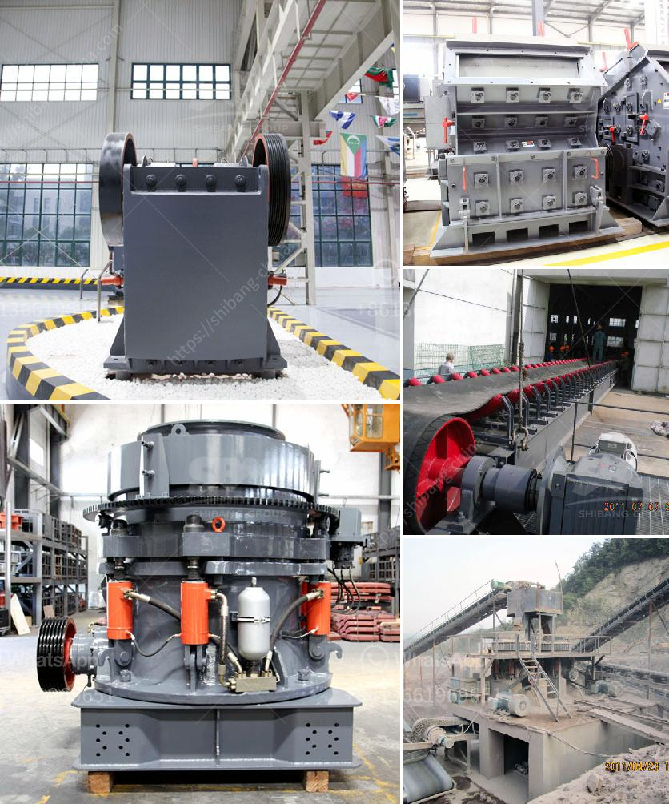

<h3>stone crusher plant project report pdf</h3>
The project consists of the setting up and operation of a stone crusher plant, a block making plant, a pre-mixed asphalt plant, a concrete batching plant, precast plant and a rock quarry on a plot of land of extent 15,000m2 (approximately) at Nsundwe area in Lilongwe District, Central Region of Malawi.

The project will provide employment opportunities for many local residents by creating a sustainable business venture that will support the local economy. It will also contribute to the infrastructure development of the area, as the stone crusher plant will be used for construction of roads, bridges, buildings and other infrastructure projects.

The objective of the project is to set up a stone crushing plant with a production capacity of 500 tons per hour. The plant will initially produce 1000 tons of crushed stones of various sizes per day, for the first 6 months, with the objective of gradually increasing the production capacity by 50% over the next 6 months.

The stone crusher plant project report pdf is a comprehensive document that outlines the proposed project, including the details of the scope of work, schedule, project cost, and other important information. The report includes feasibility study, investment analysis, project timeline, market analysis, etc.

The project will be based on the assumption that stones are mined from quarries and are crushed to produce aggregates for external sale. The total investment cost of the project is estimated to be Rs. 1,500,000, with a capital cost of Rs. 1,000,000 and a working capital of Rs. 500,000.

The project is expected to generate revenues of Rs. 2,000,000 and operate at a profit margin of 10% during the first year. The project is also expected to create direct and indirect employment opportunities for the local community, with the hiring of skilled and unskilled labor for various positions in the plant.

The stone crusher plant project report pdf highlights the importance of having a well-defined project scope, schedule, and budget for the successful implementation of the project. The project will be overseen by a project manager, who will ensure that all deliverables are met within the specified timeframes and budgets.

The project will also adhere to all relevant environmental regulations and standards to ensure minimal impact on the surrounding environment. Environmental impact assessments will be conducted to assess and mitigate any potential environmental risks associated with the proposed project.

In conclusion, the stone crusher plant project report pdf provides valuable information to stakeholders and potential investors about the project's progress and potential for success. The project has the potential to contribute significantly to the local economy and infrastructure development, while creating employment opportunities for the local community.
<h3>Contact us</h3><ul><li><strong>Whatsapp:&nbsp;<a href="https://wa.me/8613661969651">+8613661969651</a></strong></li><li><a href="https://swt.shibang-china.com/?git&amp;zhl&amp;stone crusher plant project report pdf"><strong>Online Service(chat now)</strong></a></li></ul><h3>Related</h3><ul><li><a href='3 roller raymond mill india.md'>3 roller raymond mill india</a></li><li><a href='barite mill saltillo.md'>barite mill saltillo</a></li><li><a href='quarry crusher for sale.md'>quarry crusher for sale</a></li><li><a href='talcum powder philling machine.md'>talcum powder philling machine</a></li><li><a href='best mills for barite.md'>best mills for barite</a></li></ul>