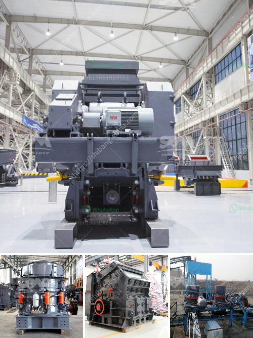

<h3>stone crusher plate specifiion pdf sat</h3>
Stone crusher plate specification pdf is a detailed description of the stone crusher machine and its various features and applications. This product is widely utilized in various crushing plants due to its robust construction, high efficiency, low maintenance, and durability. The stone crusher plate specification pdf is an essential guide for anyone involved in the production or mining industry to accurately understand the specifications of the stone crusher plate.

The stone crusher plate is one of the main components of the machine, which is used to crush the stones or rocks into smaller pieces. According to the different crushing requirements, there are various sizes, shapes, and styles of stone crusher plates that can be selected. These plates are specifically designed to withstand high-impact forces and prevent damage to the machine.

The specifications of the stone crusher plate vary depending on the application. Some common specifications include:

1. Material: The stone crusher plate is usually made of high-quality steel, such as manganese or wear-resistant steel.

2. Size: The size of the plate determines the maximum size of the stones that can be crushed. Typically, the plate dimensions range from 6 to 10 inches in length and width.

3. Thickness: The thickness of the plate determines its durability and strength. Thicker plates are usually required for heavy-duty applications.

4. Weight: The weight of the plate is an important consideration, as it affects the overall weight of the machine. Heavier plates may require more power to operate.

5. Design: The design of the stone crusher plate can vary depending on the type of stones or rocks being crushed. Different designs, such as corrugated, flat, or toothed plates, are used to enhance crushing efficiency.

In addition to these specifications, the stone crusher plate also features various other characteristics, such as:

- Easy installation: The stone crusher plate can be easily installed in the machine without requiring any special tools or equipment.

- Adjustable setting: The plate can be adjusted to achieve the desired crushing size by changing its position or angle.

- Quick maintenance: The stone crusher plate can be easily replaced or repaired, ensuring minimal downtime and increased productivity.

- Compatibility: The stone crusher plate is compatible with various types of stone crushers, making it versatile and suitable for different applications.

In conclusion, the stone crusher plate specification pdf provides detailed information about the specifications, features, and applications of the stone crusher plate. This product is essential for individuals involved in the production or mining industry, as it helps them understand the construction, functionality, and maintenance of the stone crusher machine. By understanding the specifications of the stone crusher plate, operators can optimize the performance of the machine and ensure efficient crushing operations.
<h3>Contact us</h3><ul><li><strong>Whatsapp:&nbsp;<a href="https://wa.me/8613661969651">+8613661969651</a></strong></li><li><a href="https://swt.shibang-china.com/?git&amp;zhl&amp;stone crusher plate specifiion pdf sat"><strong>Online Service(chat now)</strong></a></li></ul><h3>Related</h3><ul><li><a href='grinding unit cement plant south africa.md'>grinding unit cement plant south africa</a></li><li><a href='calcium carbonate ball milling.md'>calcium carbonate ball milling</a></li><li><a href='crusher on rent basis in nigeria.md'>crusher on rent basis in nigeria</a></li><li><a href='philippine crushing machine.md'>philippine crushing machine</a></li><li><a href='talc grinding machine manufacturer from uzbekistan.md'>talc grinding machine manufacturer from uzbekistan</a></li></ul>