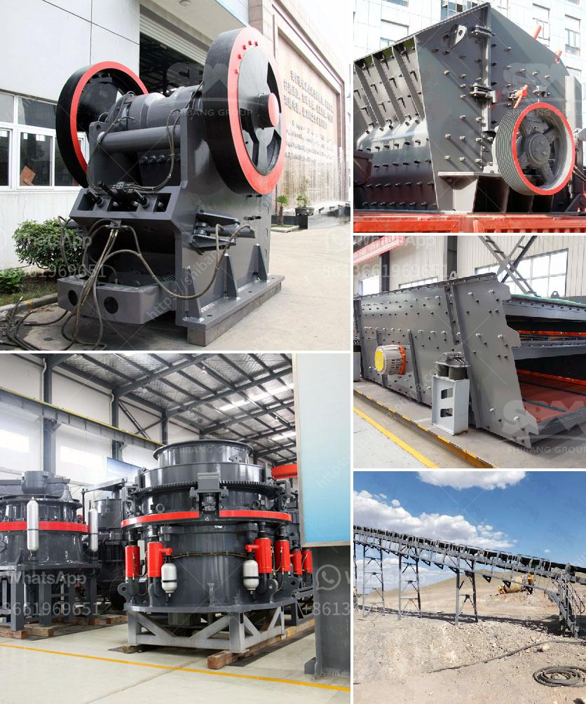

<h3>stone crusher price of ton per day</h3>
Stone crushing machine is an indispensable equipment in the mining industry, and the stone crusher price of ton per day is quite high. There are many types of stone crushers, such as jaw crusher, impact crusher, cone crusher, hammer crusher, etc.

While purchasing a stone crusher machine, the cost varies depending on the specific needs of the machine. Some customers are looking for a basic stone crushing machine, while others require a machine with multiple functions or advanced technology. These factors will influence the price range of the machine.

One of the factors that will determine the stone crusher price of ton per day is the capacity. Tons per hour used to be the industry standard for the amount of production a particular machine could produce, but as technology continues to advance, so does the ability of machines to process more. Therefore, machines with higher capacities will generally be more expensive.

Another factor that determines the price is the material processed by the stone crusher. Different materials have different requirements for the machine, thereby affecting its price. For example, hard materials like granite or basalt require more advanced technology and higher crushing strength, thus increasing the price of the machine.

Furthermore, the quality of the machine also affects its price. A high-quality stone crusher with advanced technology, excellent performance, and outstanding durability will be more expensive than a machine with lower quality. Investing in a high-quality machine might be a larger upfront cost, but it will save you money in the long run, as it will require less maintenance and provide a higher return on investment.

Additionally, the manufacturer or brand of the stone crusher will have an impact on its price. Established manufacturers with a good reputation and extensive experience in the industry tend to charge higher prices for their machines. This is because their machines are often made with superior materials, have better design, and undergo rigorous testing to ensure their reliability.

As with any industry, the law of supply and demand also applies to stone crushers. If there is a high demand for stone crushers, the price will be driven up. Conversely, if the demand is low, the price will decrease. It is essential to keep an eye on market trends and plan your purchase accordingly to get the best price.

In conclusion, the stone crusher price of ton per day is affected by various factors, including the capacity, material processed, quality of the machine, manufacturer, and market demand. It is important to do thorough research before making a purchase decision to ensure you get the best value for your investment.
<h3>Contact us</h3><ul><li><strong>Whatsapp:&nbsp;<a href="https://wa.me/8613661969651">+8613661969651</a></strong></li><li><a href="https://swt.shibang-china.com/?git&amp;zhl&amp;stone crusher price of ton per day"><strong>Online Service(chat now)</strong></a></li></ul><h3>Related</h3><ul><li><a href='products lm vertical grinding mills.md'>products lm vertical grinding mills</a></li><li><a href='model of crusher and steps of constructions.md'>model of crusher and steps of constructions</a></li><li><a href='cost of crushing equipments in nigeria.md'>cost of crushing equipments in nigeria</a></li><li><a href='price of grinding machine in india.md'>price of grinding machine in india</a></li><li><a href='sayaji jaw crusher price list.md'>sayaji jaw crusher price list</a></li></ul>