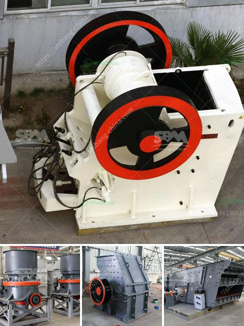

<h3>stone crusher price tons per hour</h3>
Stone crusher machine price is mainly determined by the crusher type and specific models. In addition to the above factors, stone crusher price is affected by the following technical parameters:

1. Production cost per ton of finished sandstone production cost mainly includes manpower, equipment, consumables, and energy consumption, etc. It is well known that the cost of production can be greatly reduced if the supplier or manufacturer has mature technology, advanced processing equipment, and reasonable management practices.

2. Production capacity of the equipment generally, the larger the production capacity, the higher the equipment price; on the contrary, the smaller the output, the lower the price. For example, the jaw crusher is smaller than the impact crusher, so the price will be lower. However, different crusher manufacturers have different handling capacities. Therefore, before purchasing a crusher, customers should provide specific requirements for the capacity they need, so that the manufacturer can determine the appropriate model and give a reasonable quotation.

3. The configuration of equipment the particular configuration of the machine is another factor that affects the price of the product. For example, if multiple machines are used in a single production line, then a configuration of a full set of stone crusher machines requires a higher price. Even if each machine has the same model, the price may vary widely.

4. The final quality of the materials produced by the equipment The quality of the materials produced by the equipment directly affects the sales volume and profit margin of the finished products. High-quality materials with good particle size are more popular in the market. Therefore, the production cost of the supplier is relatively low. When these two factors are combined, then the price of the equipment with better quality and more reliable performance is higher.

Stone crusher price is also affected by different transportation distances and the movement cost of the machine. If the manufacturer uses traditional transportation methods, such as road transportation, the transportation cost will be high. On the other hand, the crawler mobile crusher is suitable for crushing rock and construction waste, which greatly reduces the transportation cost and mobility is welcomed by several users.

On the market, more and more manufacturers of stone crushers have emerged. The quality of the crusher produced by these suppliers is different, and the price of the equipment also varies. Among them, manufacturers with high-quality equipment, advanced technology, good economic strength, and abundant after-sales service conditions are ideal choices for users.

In conclusion, the price of a stone crusher machine is affected by various factors, such as equipment configuration, market demand, and manufacturer competition. The customer should consider the above factors when purchasing the machine. By analyzing these factors, it is easy to determine a crusher's price.
<h3>Contact us</h3><ul><li><strong>Whatsapp:&nbsp;<a href="https://wa.me/8613661969651">+8613661969651</a></strong></li><li><a href="https://swt.shibang-china.com/?git&amp;zhl&amp;stone crusher price tons per hour"><strong>Online Service(chat now)</strong></a></li></ul><h3>Related</h3><ul><li><a href='coal crusher machine 5 ton per hours.md'>coal crusher machine 5 ton per hours</a></li><li><a href='quartz crushing machine price.md'>quartz crushing machine price</a></li><li><a href='primary crusher price in bolivia.md'>primary crusher price in bolivia</a></li><li><a href='changing jaw on a crusher.md'>changing jaw on a crusher</a></li><li><a href='how to build a gold washing plant.md'>how to build a gold washing plant</a></li></ul>