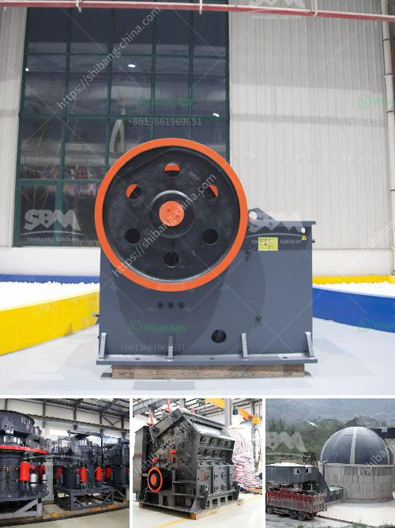

<h3>stone crusher price</h3>
Stone crusher machine price is one of the most important factors to be considered when purchasing a stone crusher. The price is influenced by the following factors:

The cost of equipment is the main factor that consumers reflect on. The price of a single equipment is about tens of thousands to hundreds of thousands, so there is a big difference in overall equipment price. For some small and medium-sized manufacturers, buying a used machine that is about to be scrapped is not only cheap but also has direct improvement in efficiency.

There are many types of stone crushers, such as jaw crusher, impact crusher, hammer crusher, cone crusher, mobile crusher, etc. However, the crusher machine is selected according to the following factors:

The material properties of the stone include hardness, cohesion, water content, etc., which determine the processing capacity and wear resistance of the equipment. For example, the higher the hardness, the larger the pressure required for crushing, and the longer the service life of the equipment.

Different types of crushers have different particle size requirements for materials. For example, jaw crushers are suitable for coarse crushing of materials, cone crushers are suitable for medium and fine crushing, and impact crushers are suitable for fine crushing.

The production cost refers to the cost consumed in the production process of the machine. It includes raw material costs, labor costs, energy consumption costs, etc. Different manufacturers have different production costs, resulting in different prices.

In addition to the above factors, market conditions will also affect the price of stone crushers. The supply and demand relationship of the market directly affects the price of equipment. When the demand is strong, the price will rise; when the demand is weak, the price will decrease.

After-sales service is also an important factor affecting the price of stone crushers. Good after-sales service can guarantee the smooth operation of the equipment, reduce downtime, and improve production efficiency. Therefore, customers should also consider the after-sales service of the manufacturer when purchasing.

In conclusion, the price of a stone crusher machine depends on many factors. The above is just a common classification of the price of stone crushers. The actual price will be affected by various factors. If you want to know more about stone crusher machine price, please feel free to contact us. We will provide you with professional answers and guidance.
<h3>Contact us</h3><ul><li><strong>Whatsapp:&nbsp;<a href="https://wa.me/8613661969651">+8613661969651</a></strong></li><li><a href="https://swt.shibang-china.com/?git&amp;zhl&amp;stone crusher price"><strong>Online Service(chat now)</strong></a></li></ul><h3>Related</h3><ul><li><a href='rock crusher plant cost.md'>rock crusher plant cost</a></li><li><a href='price kenya crushers.md'>price kenya crushers</a></li><li><a href='portable sand grinding machine.md'>portable sand grinding machine</a></li><li><a href='germany standard pyrophyllite powder grinding mill.md'>germany standard pyrophyllite powder grinding mill</a></li><li><a href='sample of granite quarry proposal.md'>sample of granite quarry proposal</a></li></ul>