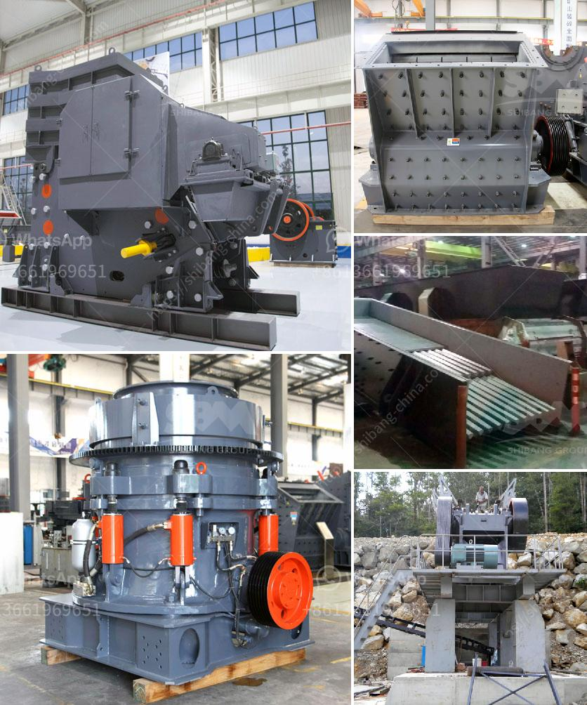

<h3>stone crusher rent based mobile machine</h3>
Stone crusher rent based mobile machine is specialized in manufacturing stone crushing machines, including crushers, grinders, sand making machines, sand washing machines, vibrating screens, vibrating feeders, Pulverizers, belt conveyors and crushers. Depending on the application requirements, the machine can be constructed as a stationary or mobile unit. Furthermore, these machines can also be used for recycling of concrete waste and asphalt.

The mobile stone crushing machine has the advantage of reasonable matching, unobstructed discharge line, reliable working, convenient operation, high efficiency and low capital cost. It especially adapts to the construction waste crushing process as it integrates crushing, screening and conveying together. The most outstanding feature of the mobile crusher is flexibility and mobility, which minimizes the overall construction cost and expands the working scope.

Mobile stone crusher rent based mobile machines easily fulfill majority of construction requirements of stone, coal, limestone, granite, basalt, quartz, iron ore, gold ore, and other materials. We provide rental services of mobile crushers with capacity of 50 TPH to 200 TPH. These mobile crushers are provided on long term hire / lease basis mainly for road projects, port construction or other civil construction works. We are looking for crushing and screening rental equipment suppliers who are interested to partner with us and help us to expand our presence in the construction field.

In the short run, both new and used stone crushers can be rented out to interested contractors. The buyers also have a choice to make between stone crushers rent and sale. Another factor to consider in choosing between renting and purchasing is the overall cost of ownership. While renting may seem more beneficial in the short-term, it can prove much more expensive over the long run with repeated payments.

Rent-based mobile stone crushers can be defined as self-propelled, self-supported units that can crush material transported from the mining face and store it in a separate location nearby. This eliminates the need for a hauling system, resulting in lower operating costs and reduced production time.

The mobile stone crushing machine can be positioned close to the working face and then relocated under its own power in as little as 20min. The potential cost savings arising from the use of a mobile crushing and conveying system based at the rock face can be significant. SBM is world leading stone crushing equipment supplier and manufacturer; we provide complete series of portable stone crushing machine for sale.

The mobile or portable jaw crushers combine a high reduction ratio and increased capacity with any feed materials: from extra hard rock to recycled materials. Mobile jaw crusher plant price is reasonable for customers all over the world.

The excellent performance of the mobile jaw crusher is achieved through several unique features such as higher crushing ratio, optimized engineering, and easy adjustment. The jaw crushers are equipped with a proven, rugged and fast wedge-setting adjustment system and available as manual or hydraulic alternatives.

The impact crushers are based upon more than 40 years of experience with the impact method. We offer a complete range of impact crushers for stationary, semi-mobile fully mobile applications in both primary and secondary crushing.

Cone crusher is the chrome ore crushing machine utilized in chrome processing plant. Hydraulic cone crusher gets to world advanced level, it can be designed and made through absorbing world advanced crushing technology. Our cone crusher for rent and sale can be used in construction, metallurgy, road building, chemical and stone industry.

SBM's mobile crusher for sale, a newly designed rock crushing & screening plant, which is flexible, convenient and strong mobility, can save a large construction capital and relocation.

Raw materials can be reduced at the mine site without being transported again and also can be moved with the promotional exploitation of the raw material, which saves a large number of transportation costs. 

Furthermore, the longer machine assembly will put the crushed materials into the bucket of the transporter directly, and then can be transported from the crushing scene. Simply and effectively crushing and grinding on-site without additional transportation of raw materials will be achieved through mobile crusher.

To sum up, the mobile stone crusher rent based mobile machine has become the most demanded stone crusher machine rental contract in recent years. The rental company provides reliable service for all customers. The mobile stone crusher rental machine saves the time and money required during the installation and operation of the crusher. It is also convenient to move and allows the ease of transportation. The mobile crusher rental service eliminates the need for investing in expensive rotary wear parts, significant oil consumption, high costly maintenance, and repairs. Furthermore, we recall users' considerations of the rental equipment at the same time, undertake the comprehensive after-sales service, and ensure stable operation during production, and also will enhance the production capacity.
<h3>Contact us</h3><ul><li><strong>Whatsapp:&nbsp;<a href="https://wa.me/8613661969651">+8613661969651</a></strong></li><li><a href="https://swt.shibang-china.com/?git&amp;zhl&amp;stone crusher rent based mobile machine"><strong>Online Service(chat now)</strong></a></li></ul><h3>Related</h3><ul><li><a href='calcium carbonate for ball mill.md'>calcium carbonate for ball mill</a></li><li><a href='calcium carbonate powder mill price.md'>calcium carbonate powder mill price</a></li><li><a href='tonnes per year cement plant machinary.md'>tonnes per year cement plant machinary</a></li><li><a href='double jaw crusher.md'>double jaw crusher</a></li><li><a href='roll ball mill industries.md'>roll ball mill industries</a></li></ul>