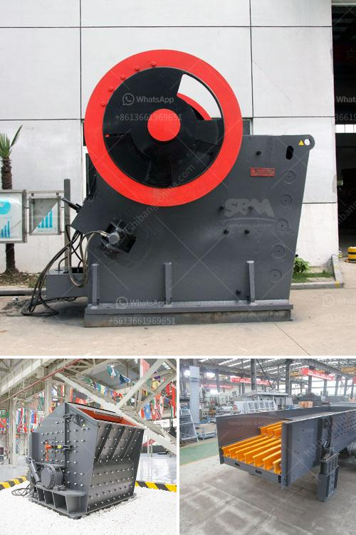

<h3>stone crusher sale lease</h3>
Stone crusher sales and lease business is booming these days. With the ongoing development projects, whether it is housing or industrial construction activities, the demand for crushed stone is increasing rapidly.

More and more people are interested in buying stone crushers to handle their construction projects. To initiate this business venture, you would first need to acquire a stone crushing license from the concerned authority. In the process of obtaining the license, you would need to submit various documents such as your project plan, machinery details, and investment budget.

Once you have acquired the license, you can begin by leasing a stone crusher and generating income through its operation. The demand for crushed stones is increasing across various sectors, such as residential, commercial, and industrial construction. This provides an excellent opportunity for entrepreneurs in the stone crushing business.

Leasing and sale of stone crushers can be used in different stages of the crushing process. For instance, you can choose to lease a stone crusher machine for a specific period and then extend the contract based on your requirement. You can also buy a stone crusher machine, depending on the scale of your business. Larger companies may choose to invest in stationary crushing plants, while smaller businesses can opt for portable or mobile units.

Stone crushers are essential equipment in mining and stone quarrying activities. Based on the construction requirements, stone crushers are classified into different categories such as primary, secondary, and tertiary crushers. Depending on the size of the stone, the crushers can be used to reduce it into smaller pieces, like gravel or dust.

Leasing a stone crusher allows you to save on transportation costs. You can easily move the machine from one site to another without any hassle. Additionally, leasing also eliminates the need for maintenance and repair costs, as the leasing company is responsible for providing you with a machine in good working condition. This aspect is especially beneficial for small businesses with limited funds.

Leasing stone crushers can also be a profitable option while waiting for the construction industry to pick up pace. By leasing a stone crusher, you can generate revenue from the existing demand for crushed stone in your area and later invest in a larger machine as per the demand.

To conclude, stone crusher sales and lease business is a lucrative venture, especially for entrepreneurs who are passionate about the construction industry. With the increasing demand for crushed stones, investing in this business can be highly profitable. Whether you choose to lease or buy a stone crusher, make sure to do thorough market research to understand the demand and competition in your area. With the right approach and proper management, you can expect a steady income from your stone crusher business.
<h3>Contact us</h3><ul><li><strong>Whatsapp:&nbsp;<a href="https://wa.me/8613661969651">+8613661969651</a></strong></li><li><a href="https://swt.shibang-china.com/?git&amp;zhl&amp;stone crusher sale lease"><strong>Online Service(chat now)</strong></a></li></ul><h3>Related</h3><ul><li><a href='roller mill for onions.md'>roller mill for onions</a></li><li><a href='cost of graphite beneficiation plant.md'>cost of graphite beneficiation plant</a></li><li><a href='conveyor belt for sale in south africa.md'>conveyor belt for sale in south africa</a></li><li><a href='shell powder making machine grinding mill for sale.md'>shell powder making machine grinding mill for sale</a></li><li><a href='components of industrial conveyor belts.md'>components of industrial conveyor belts</a></li></ul>