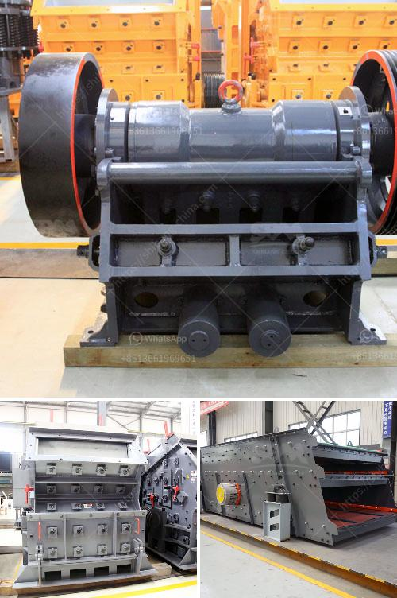

<h3>stone crusher sand vs river sand for construction</h3>
Stone crusher sand is a substitute for river sand in the construction industry. Stone crusher sand is produced from granite rocks using technology that crushes rocks into sand-sized angular particles. The sand particles have rough texture and are therefore excellent for construction purposes.

River sand, on the other hand, is obtained from river beds and banks. It is fine and rounded in shape. The smooth and rounded nature of river sand makes it suitable for various construction activities such as plastering, brickwork, and concrete work.

When comparing stone crusher sand vs river sand, there are two major factors to consider: quality and cost.

Firstly, quality: Stone crusher sand is manufactured by crushing granite rocks. It is a better alternative to river sand as it is finer and contains fewer impurities. However, the quality of m sand depends on the crusher's quality, distance from the source of raw materials, and manufacturing process. It is crucial to choose a reliable supplier of stone crusher sand to ensure the best quality for construction purposes.

On the other hand, river sand is natural sand obtained from rivers. It has a smooth texture and is free from impurities such as clay, silt, and organic matter. Since river sand is obtained directly from river beds, it is considered of high quality for construction purposes.

Secondly, cost: The cost of stone crusher sand is generally higher than that of river sand due to the high crushing and manufacturing costs involved. However, stone crusher sand is more cost-effective in the long run because it lasts longer and requires fewer repairs and maintenance.

River sand, on the contrary, may seem cheaper initially, but it is less durable and requires frequent replacement, leading to additional costs in the long term.

In conclusion, both stone crusher sand and river sand have their own advantages and disadvantages. It is crucial to consider factors such as quality and cost before choosing the right type of sand for construction purposes. Stone crusher sand is a viable alternative to river sand and can deliver significant benefits in terms of quality and cost-effectiveness.
<h3>Contact us</h3><ul><li><strong>Whatsapp:&nbsp;<a href="https://wa.me/8613661969651">+8613661969651</a></strong></li><li><a href="https://swt.shibang-china.com/?git&amp;zhl&amp;stone crusher sand vs river sand for construction"><strong>Online Service(chat now)</strong></a></li></ul><h3>Related</h3><ul><li><a href='consol glass recycling price list south africa.md'>consol glass recycling price list south africa</a></li><li><a href='track mounted coal crushers indonesia.md'>track mounted coal crushers indonesia</a></li><li><a href='cs cone crusher.md'>cs cone crusher</a></li><li><a href='small stone crusher price in india.md'>small stone crusher price in india</a></li><li><a href='rock crusher portable.md'>rock crusher portable</a></li></ul>