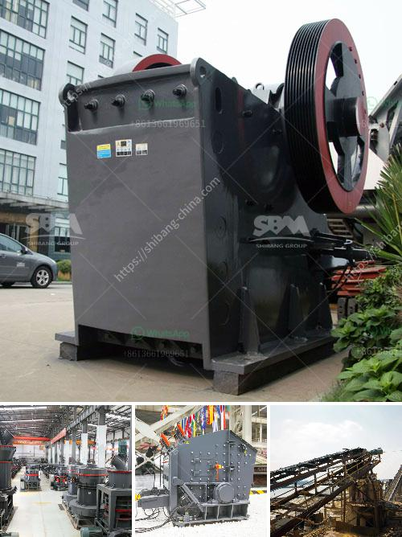

<h3>stone crusher sri lanka</h3>
Stone Crusher Sri Lanka, also known as stone crushers, is widely used in mining, metallurgy, building materials, chemicals, and other industries.

Stone crushers are usually located in the vicinity of construction sites or stone quarries. They are used to break large stones into smaller sizes or produce gravel for use in construction and other applications. 

There are several types of stone crushers available in Sri Lanka, such as jaw crushers, cone crushers, impact crushers, and hammer crushers. They differ in their crushing principles, sizes, and capacities. 

Jaw crushers are commonly used for primary crushing, where the stones are compressed between a fixed jaw and a moving jaw. This type of crusher is suitable for crushing various types of ores and bulk materials into medium-sized particles. Jaw crushers have the advantages of large crushing ratio, high production capacity, and uniform product size.

Cone crushers, on the other hand, are used for secondary crushing. They are similar to gyratory crushers, but operate with a rotating cone instead of a stationary one. Cone crushers are widely used in mining and aggregate industries, and they have the advantages of high crushing ratio, low energy consumption, and uniform product size.

Impact crushers utilize impact force to crush materials. They are often used for the final stage of crushing, producing cubic-shaped stones for railway ballast, asphalt, and concrete aggregates. Impact crushers are known for their high production capacity and excellent reduction ratios.

Hammer crushers, also known as hammer mills, use rotating hammers to crush materials. They are suitable for crushing brittle and soft materials, such as limestone, gypsum, and coal. Hammer crushers are widely used in mining, cement, coal, metallurgy, building materials, highway construction, and other industries.

In Sri Lanka, stone crushers are typically located near major rivers, bodies of water, or along the coastline. This is because they require a constant water supply to operate efficiently. Stone crushers extract rubble and other debris from the water and convert them into usable gravel, sand, and other materials. 

The demand for stone crushers in Sri Lanka is growing every year, which has led to a surge in new stone crushers being set up. However, not all of them are able to produce high-quality aggregates required for various construction projects. 

To ensure the quality of the aggregates produced by stone crushers, strict regulations and standards have been put in place by the Sri Lankan government. These regulations include the use of advanced technologies, such as dust control systems, to minimize dust emissions during the crushing process. Additionally, stone crushers are required to follow sustainable practices and adhere to environmental regulations.

In conclusion, stone crushers in Sri Lanka play a crucial role in the construction industry and quarry operations. They offer the possibility of recycling materials and producing aggregates for use in construction projects. However, it is important for stone crushers to operate in compliance with environmental regulations to ensure the sustainability of these industries.
<h3>Contact us</h3><ul><li><strong>Whatsapp:&nbsp;<a href="https://wa.me/8613661969651">+8613661969651</a></strong></li><li><a href="https://swt.shibang-china.com/?git&amp;zhl&amp;stone crusher sri lanka"><strong>Online Service(chat now)</strong></a></li></ul><h3>Related</h3><ul><li><a href='gold processing equipment.md'>gold processing equipment</a></li><li><a href='used limestone pulverizers crusher for sale texas.md'>used limestone pulverizers crusher for sale texas</a></li><li><a href='advantages of hammer mill.md'>advantages of hammer mill</a></li><li><a href='crushing plant for irion ore.md'>crushing plant for irion ore</a></li><li><a href='used equipment ball mill sale.md'>used equipment ball mill sale</a></li></ul>