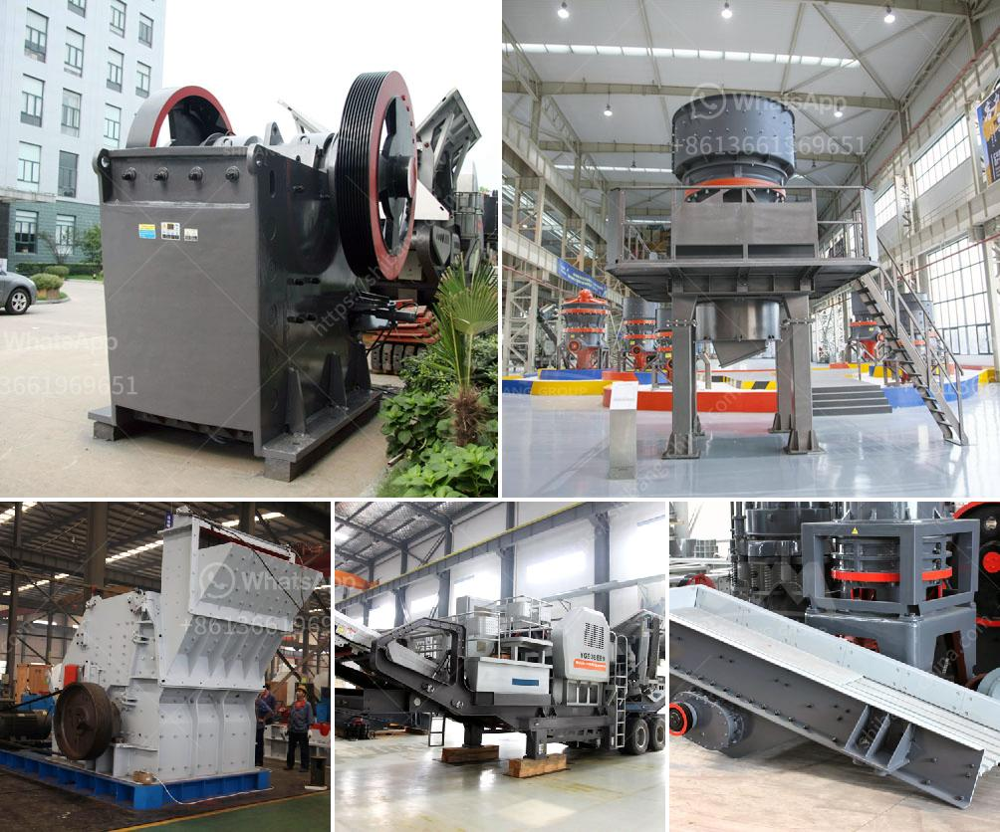

<h3>stone crusher supplier company</h3>
Stone Crusher Supplier Company,  also known as Luohe Zhongyuan Hydraulic Engineering Co., Ltd., is a renowned company in China for producing a variety of crushing machines. Known for its superior performance and durable construction, the company is fully committed to delivering the best-in-class stone crusher machines to its clients.

With over 20 years of experience in the industry, Stone Crusher Supplier Company has established itself as a leading supplier of mechanical equipment used for crushing stone into desired sizes. Their machines are manufactured using high-grade materials and advanced technology to ensure maximum efficiency and reliability.

One of the key factors that set Stone Crusher Supplier Company apart from its competitors is its strong focus on quality. The company follows strict quality control measures at every stage of the manufacturing process to ensure that its products meet international standards. Each machine goes through rigorous testing before being sent out to the clients, ensuring that only superior-quality machines are delivered.

Stone Crusher Supplier Company offers a wide range of products to its clients, including jaw crushers, impact crushers, cone crushers, vibrating screens, vibrating feeders, belt conveyors, etc. These machines not only meet the specific requirements of the clients but are also engineered to deliver consistent performance and durability.

One of the main advantages of choosing Stone Crusher Supplier Company is its ability to customize the machines as per the clients' requirements. Their team of experienced engineers and technicians work closely with the clients to understand their needs and design the machines accordingly. From selecting the right materials to incorporating the latest technology, every aspect is taken into consideration to ensure that the final product meets the clients' expectations.

Apart from the quality of their products, Stone Crusher Supplier Company also prides itself on its excellent customer service. The company believes in building long-term relationships with its clients and is committed to providing timely assistance and support. Whether it is delivering the machines on time or addressing any post-sales issues, they are always ready to go the extra mile to ensure customer satisfaction.

Stone Crusher Supplier Company has a global presence and serves clients from various industries such as mining, construction, and infrastructure development. Their machines have been widely used in numerous projects around the world and have consistently received positive feedback for their performance and reliability.

In conclusion, Stone Crusher Supplier Company stands out as a world-class manufacturer of crushing machines. Its commitment to quality, customization, and excellent customer service has made it a preferred choice for clients across the globe. With its extensive range of products and unwavering dedication to providing innovative solutions, Stone Crusher Supplier Company continues to set new benchmarks in the industry.
<h3>Contact us</h3><ul><li><strong>Whatsapp:&nbsp;<a href="https://wa.me/8613661969651">+8613661969651</a></strong></li><li><a href="https://swt.shibang-china.com/?git&amp;zhl&amp;stone crusher supplier company"><strong>Online Service(chat now)</strong></a></li></ul><h3>Related</h3><ul><li><a href='quartz beneficiation.md'>quartz beneficiation</a></li><li><a href='100tpd cement plant cost in india.md'>100tpd cement plant cost in india</a></li><li><a href='bauxite crusher for sale.md'>bauxite crusher for sale</a></li><li><a href='laporan praktikum jaw crusher dan analisis ayakan.md'>laporan praktikum jaw crusher dan analisis ayakan</a></li><li><a href='hard rock ultrafine grinder in canada.md'>hard rock ultrafine grinder in canada</a></li></ul>