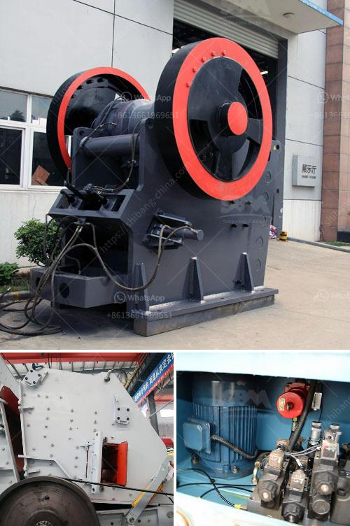

<h3>stone crusher to make gravel</h3>
Stone crushing is an important step in the construction industry. In recent years, the demand for gravel has been increasing. Whether due to the infrastructure of large cities or the demolition of old buildings, more and more gravel is needed to satisfy the market demand. To obtain this gravel, we need to use a stone crusher machine to crush the raw materials into the required size. In this article, we will discuss the advantages and characteristics of these gravel crushes.

Stone crusher machines are widely used in mining industry. There are various types of crusher machine, including jaw crusher, impact crusher, cone crusher, sand making machine, hammer crusher, and mobile crusher plant, etc. Following is the detail introduction of stone crusher machine type.

The jaw crusher machine has simple structure, which is divided into C series, JC series, PE series. It almost covers the whole coarse and medium crushing process of rock. Not much impact crusher, cone crusher, wear-resistant parts, but the jaw crusher is an investment. Adding a jaw crusher liner to crushed granite stone and river pebble, the liner will help extend the life of the stone crusher as well as enhance its crushing efficiency.

Used for medium-sized hard materials, such as limestone, granite, basalt, cobblestone, etc. The work principle of impact crusher - epiroc john holland are that the rotor rotate at high speed driven by a belt, and on the rotor there are series impact plates. When the materials enter into the crushing chamber, they will be crushed by the impact plate and the rotor. For the application of the impact crusher in dolomite, the impact crusher has a good effect on dolomite grinding. You can choose a counter crusher cone crusher, jaw crusher, sand making machine, etc.

Cone crusher is mainly used for medium-fine crushing, such as iron ore, non-ferrous metal ore, granite, limestone, quartzite, sandstone, river pebble, etc. For hard stones such as cobblestone, granite, coal gangue, if adopt the crushing process of "jaw crusher + sand maker", it may cause serious wear of the sand making machine. For reducing the invest cost, for fine crushing, use cone crusher, jaw crusher for rough breaking, and sand crusher for further breaking.

Sand making machine is the core equipment of the whole sand aggregate production line. It is used to crush and shape gravel raw materials with excellent particle size characteristics, which can directly produce sand and gravel materials with various specifications and meet different construction standards. The sand making machine can carry out the shaping process of various rocks, and the aggregate produced by it has excellent particle size, full corners, and high gradation, which can completely meet the requirements of the market.

In conclusion, stone crusher machines should be chosen according to the hardness and size of the raw materials required for gravel production. Long-term operation and frequent maintenance and repair are needed to ensure the effective operation of the stone crusher machine. Thus, it is recommended to choose a reliable manufacturer and choose the appropriate stone crusher machine according to your own needs and various factors to create more profits.
<h3>Contact us</h3><ul><li><strong>Whatsapp:&nbsp;<a href="https://wa.me/8613661969651">+8613661969651</a></strong></li><li><a href="https://swt.shibang-china.com/?git&amp;zhl&amp;stone crusher to make gravel"><strong>Online Service(chat now)</strong></a></li></ul><h3>Related</h3><ul><li><a href='india stone crusher plant production line.md'>india stone crusher plant production line</a></li><li><a href='steed conveyor belting.md'>steed conveyor belting</a></li><li><a href='hammer mill for ldpe grinding.md'>hammer mill for ldpe grinding</a></li><li><a href='sand production project cost in india.md'>sand production project cost in india</a></li><li><a href='jaw crusher price list 150 x 200mm.md'>jaw crusher price list 150 x 200mm</a></li></ul>