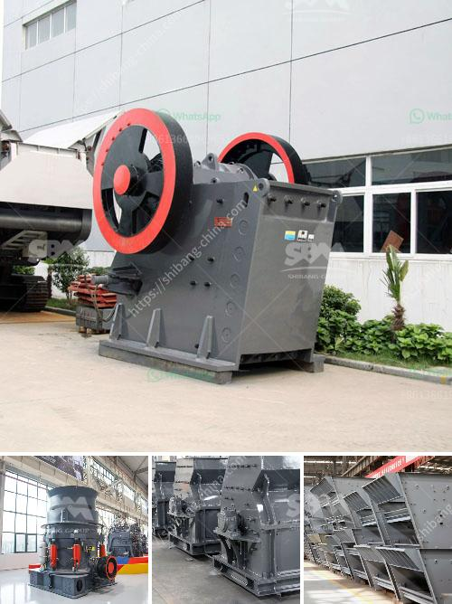

<h3>stone crusher vibrating screen for sale</h3>
Stone crusher vibrating screen is widely used in the mining industry to separate various sizes of aggregate material. This machine is designed to efficiently and effectively remove unwanted fines and separate coarse aggregate material for further crushing. Unlike manual screening, this vibrating screen is designed with high precision and efficiency. It also performs well in scalping and heavy-duty screening.

The stone crusher vibrating screen is widely used for grading and screening materials in the following fields: minerals, quarry, building materials, water conservancy and hydropower, transportation, chemical industry, smelting and so on. The vibrating screen is especially designed for screening stones and features reliable structure, strong vibration force, high screening efficiency, low vibrating noise, excellent durability, convenient maintenance, safe use, etc.

The stone crusher vibrating screen is mainly composed of screen box, vibrator, suspension system, transmission system, etc. The vibrator is located on the side plate of the screen box and is driven by the motor through the V-belt to generate centrifugal inertial force, forcing the screen box to vibrate. The side plate of the screen box is made of high-quality steel plate, and the side plate is connected with the beam and the base of the screen box with high-strength bolts or ring groove rivets. The motor drives the spindle to rotate through the V-belt, and the eccentric weight is generated by the vibration force which forces the screen box to vibrate. By changing the eccentric weight of the motor, different amplitudes can be achieved, and the feeding and discharging can be adjusted conveniently.

The stone crusher vibrating screen has the advantages of reliable structure, strong excitation force, high screening efficiency, low vibration noise, sturdy and durable, convenient maintenance and safe use. Its eccentric mass helps create uniform motion in all areas of the screen, thereby avoiding any violent shaking and ensuring smooth operation.

When choosing a vibrating screen for stone crushing plant, it is important to carefully consider the factors that will affect the performance of the machine. The size, amplitude, and angle of inclination of the screen surface are all factors that should be considered. The larger the screen size, the higher the production capacity of the vibrating screen. However, it should be noted that an increase in the screen size can lead to a decrease in screening efficiency. Therefore, it is crucial to find the right balance between screen size and screening efficiency.

In conclusion, the stone crusher vibrating screen is a reliable and efficient equipment in mining industry for both small and large scale stone crushing operations. With the increasing demands of high-quality aggregate products, it is necessary for stone quarries to invest in high-quality stone crusher vibrating screen to improve the efficiency and aggregate quality.
<h3>Contact us</h3><ul><li><strong>Whatsapp:&nbsp;<a href="https://wa.me/8613661969651">+8613661969651</a></strong></li><li><a href="https://swt.shibang-china.com/?git&amp;zhl&amp;stone crusher vibrating screen for sale"><strong>Online Service(chat now)</strong></a></li></ul><h3>Related</h3><ul><li><a href='small stone crusher machine.md'>small stone crusher machine</a></li><li><a href='rotary breaker for coal 200tph.md'>rotary breaker for coal 200tph</a></li><li><a href='stone crusher machine company.md'>stone crusher machine company</a></li><li><a href='busines project proposal for stone crusher.md'>busines project proposal for stone crusher</a></li><li><a href='pakistan directory of cement plants list pdf.md'>pakistan directory of cement plants list pdf</a></li></ul>