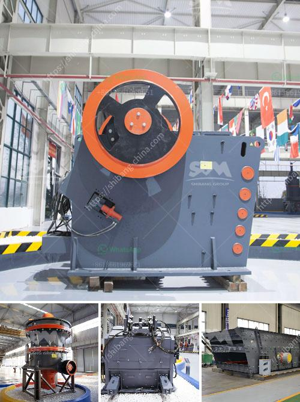

<h3>stone crushers for sale china</h3>
Stone crushers are heavy-duty machines used to reduce large rocks into smaller rocks, gravel, or rock dust. These machines are commonly used in construction, mining, and various other industries. China is one of the world's largest producers of stone crushers, and the market for these machines is expected to grow at a significant pace in the coming years.

China's stone crushers for sale are available in a variety of models with different capacities, feed sizes, and motor power. With a wide range of options available, buyers can find the perfect stone crusher to meet their specific requirements. These machines are built to handle tough materials and are highly efficient in crushing rock, stone, and other materials.

One of the key advantages of stone crushers from China is their affordability. Compared to other machines in the market, Chinese stone crushers are relatively cheaper, making them accessible to a wide range of customers. This affordability factor has contributed to the popularity of Chinese stone crushers worldwide.

Another advantage of buying stone crushers from China is the high-quality standards that these machines adhere to. The Chinese government has strict regulations in place to ensure that stone crushers meet the necessary safety, environmental, and quality standards. This means that buyers can trust Chinese stone crushers to deliver reliable performance and longevity.

In addition to affordability and quality, Chinese stone crushers are also known for their versatility. These machines can be used to crush various types of rocks, including granite, limestone, river pebbles, and more. Moreover, Chinese stone crushers are highly mobile and can be easily moved from one location to another, making them ideal for on-site crushing operations.

In conclusion, stone crushers for sale from China offer a great combination of affordability, quality, and versatility. These machines are built to withstand tough conditions and can handle a wide range of materials. With their rising popularity, it is expected that the market for stone crushers in China will continue to grow in the coming years.
<h3>Contact us</h3><ul><li><strong>Whatsapp:&nbsp;<a href="https://wa.me/8613661969651">+8613661969651</a></strong></li><li><a href="https://swt.shibang-china.com/?git&amp;zhl&amp;stone crushers for sale china"><strong>Online Service(chat now)</strong></a></li></ul><h3>Related</h3><ul><li><a href='clay ceromic manufacturing process.md'>clay ceromic manufacturing process</a></li><li><a href='quartz stone plant in china.md'>quartz stone plant in china</a></li><li><a href='but concrete crushers nigeria.md'>but concrete crushers nigeria</a></li><li><a href='iron jaw crusher with output of mm.md'>iron jaw crusher with output of mm</a></li><li><a href='100tpd cement plant in india.md'>100tpd cement plant in india</a></li></ul>