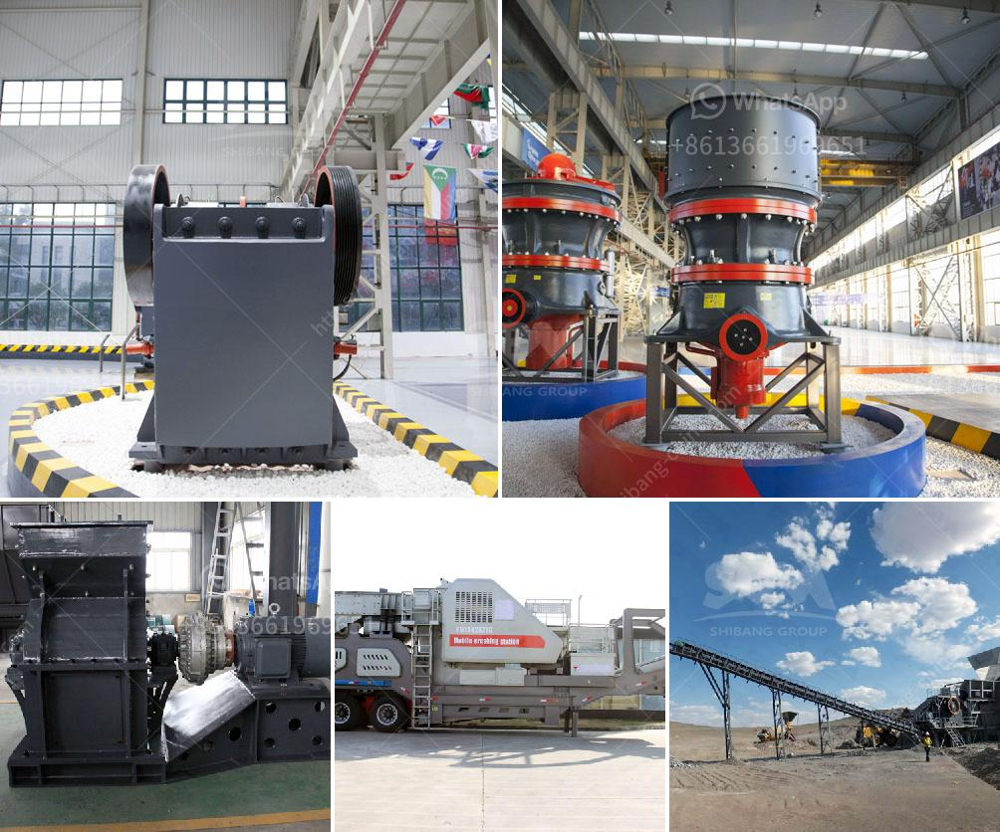

<h3>stone crushers for sale in philippines</h3>
Stone crushers are widely used in mining, metallurgy, building materials, highways, railways, water conservancy and chemical industries. And it is suitable for crushing various materials with Mohs hardness below 9.3 and compression strength within 350MPa. The emergence of such crushers has greatly improved the crushing efficiency, and the fineness of the finished product is especially high.

The Philippines is rich in mineral resources, and mining and quarrying are important industries in the country. Many stone crushers are established to help the traditional industries continue their dominance in the Philippine economy. Stone crushing machine suppliers may have their own quarries, and they would often sell their stone crushing machinery directly to quarries.

The mining industry requires stone crushers to handle the production needs of different customers. The production requirements of different users are different. The specifications of the selected types of crushers are also different. Each user's production requirements are not necessarily the same. Therefore, the market sales matching is particularly important.

When purchasing stone crushers for sale in the Philippines, there are some factors that you should think about. The materials to be crushed are different, and businesses have different requirements for the crushers they purchase. Before buying a stone crusher, you should ensure that the specifications of the crusher meet your requirements. When the crusher is in operation, its crushing ratio is an important factor to evaluate the performance. Different crushing devices have different crushing ratios, and the crushing ratio is inseparable from the nature of the material being crushed.

It is not difficult to find stone crusher in Philippines when browsing the Internet. More and more manufacturers have shifted from the traditional selling way to online selling because of the convenience and efficiency. In order to improve the sales of stone crushers, many manufacturers have started to use online marketing. However, there are still some obstacles to online sales due to lack of trust and understanding in the traditional industries. But with the popularization of online transactions, the sales volume of stone crushers for sale in the Philippines will also increase.

If you want to get adjust the output size range of stone crusher, you should firstly make clear about the requirements. In most countries, the stone crushers are usually used in the quarrying and mining industries. However, in the Philippines, they are usually used to crush hard stones. These hard stones are usually granite, basalt, or river pebbles. The size should be between 5 to 20mm for good construction materials.

In summary, the Philippines and its stone crushing industry have a bright future. Stone crushers have a wide variety of models, types, and specifications. Different crushers are suitable for different production needs. They are the ideal equipment for constructing highways, railways, water conservancy, bridges, and other infrastructure projects. Thus, stone crushers for sale in the Philippines have become more and more popular.
<h3>Contact us</h3><ul><li><strong>Whatsapp:&nbsp;<a href="https://wa.me/8613661969651">+8613661969651</a></strong></li><li><a href="https://swt.shibang-china.com/?git&amp;zhl&amp;stone crushers for sale in philippines"><strong>Online Service(chat now)</strong></a></li></ul><h3>Related</h3><ul><li><a href='price of quarry crusher in zambia.md'>price of quarry crusher in zambia</a></li><li><a href='coal and grinding machine cost.md'>coal and grinding machine cost</a></li><li><a href='roller crusher for coal.md'>roller crusher for coal</a></li><li><a href='business proposal for stone quarry project.md'>business proposal for stone quarry project</a></li><li><a href='made for conveyor belts in uae.md'>made for conveyor belts in uae</a></li></ul>