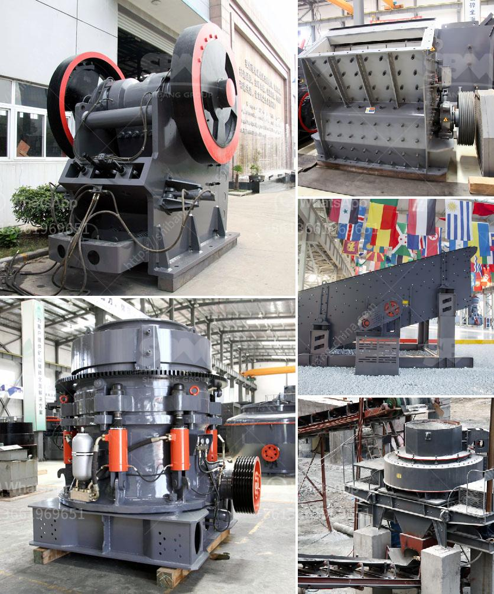

<h3>stone crushers suppliers in south africa</h3>
Stone crushers are essential crushing equipment in mining and stone quarry site. In stone quarry, stone crushers are used to crush stones into small particle size or change the form such as basalt, granite, limestone, quartz, marble, for building aggregates, artificial sand production and recycle building waste materials such as debris, ariana, bottom ash. Stone crushers can also be used in crushing circuit producing particle size to suit the requirement of client.

In recent years, with the rapid development of infrastructure construction in South Africa, the demand for stone crushers is increasing, so stone crushers suppliers are also increasing. In recent years, many suppliers in order to meet the market demand, manufacturing crusher, sand making machine and other equipment constantly updated. In terms of technology, innovation has also been made. Many suppliers have launched a new cycle crusher in the market, such as jaw crusher, counterattack crusher, cone crusher, etc. These crushers have many advantages such as high efficiency, large crushing ratio, uniform product size, and low maintenance cost.

Stone crushers suppliers in South Africa are leading the way in making improvements to meet market demand for high quality aggregate, which is in short supply following the decline of the construction industry in South Africa. This has opened up many opportunities in the region for manufacturers to penetrate the market and provide their products and services. 

One of the key suppliers in South Africa is Pilot Crushtec, a leading supplier of crushing, screening and material handling equipment to the mining, quarrying, and various other industries. They have been in the business for over 30 years and have a team of professionals that can provide expert advice and support to customers. 

Other notable suppliers in South Africa include Osborn, Metso, and Bell Equipment, among others. These suppliers have a wide range of products and services to offer, from crushers and screens to conveyors and feeders. 

In conclusion, the stone crushers suppliers in South Africa have a wide variety of options to choose from, making it easier for customers to choose the right product and service for their needs. With the increasing demand for stone crushers in the region, it is expected that the suppliers will continue to innovate and improve their products to meet market demand.
<h3>Contact us</h3><ul><li><strong>Whatsapp:&nbsp;<a href="https://wa.me/8613661969651">+8613661969651</a></strong></li><li><a href="https://swt.shibang-china.com/?git&amp;zhl&amp;stone crushers suppliers in south africa"><strong>Online Service(chat now)</strong></a></li></ul><h3>Related</h3><ul><li><a href='stone crushers for sale in philippines.md'>stone crushers for sale in philippines</a></li><li><a href='granite mining business plan.md'>granite mining business plan</a></li><li><a href='high efficiency separator for raw material ball mill.md'>high efficiency separator for raw material ball mill</a></li><li><a href='used stone crusher plant for sale in uk.md'>used stone crusher plant for sale in uk</a></li><li><a href='crushing plants pawer screen.md'>crushing plants pawer screen</a></li></ul>