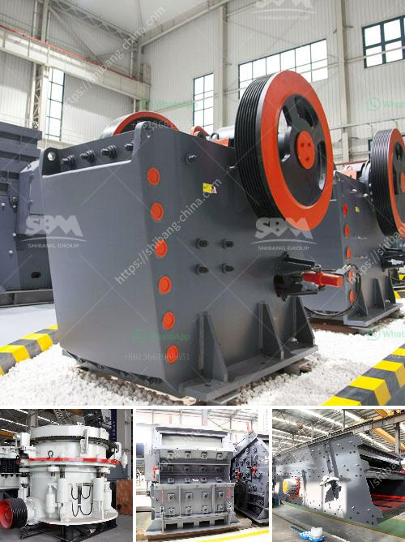

<h3>stone crushers supply</h3>
Stone crushers supply is an important issue in the construction industry. Stone crushers are used for crushing stones into smaller sizes for building purposes. They are essential machinery for the construction industry, as they reduce the size of large stones and rocks to a more manageable size.

Stone crushers are primarily used for crushing various types of stones and rocks into smaller sizes to be used for construction purposes. There are different types of stone crushers that are used to crush rocks and stones of different hardness levels. Some of the commonly used stone crushers include jaw crushers, cone crushers, impact crushers, and mobile crushers.

Stone crushers supply is crucial for the construction industry as they provide the essential material required for building purposes. Stones are an important raw material in construction, used for building roads, bridges, houses, and other infrastructure. Without the supply of stone crushers, it would be challenging to obtain the necessary material for construction projects.

The supply of stone crushers is influenced by several factors. One significant factor is the demand for construction projects. When there is an increase in construction projects, there is a higher demand for stone crushers. This leads to more manufacturers and suppliers entering the market to meet the demand.

Another factor that affects the supply of stone crushers is the availability of raw materials. Stone crushers require raw materials such as stones and rocks to be crushed. If there is a shortage of raw materials, it can lead to a decrease in the supply of stone crushers. Raw material availability can be influenced by various factors, such as mining regulations, geographical location, and environmental concerns.

The supply of stone crushers also depends on the efficiency and capacity of the crushers. Higher capacity crushers can process more stones and rocks, resulting in a higher supply of crushed material. Additionally, efficient crushers consume less energy and produce less waste, making them more desirable for construction projects.

To ensure a steady supply of stone crushers, it is crucial to have a well-established network of manufacturers, suppliers, and distributors. This network should be able to cater to the demand of the construction industry in a timely manner. Quality control measures should also be in place to ensure that the stone crushers supplied meet the required standards.

In conclusion, stone crushers supply is a significant aspect of the construction industry. Stone crushers are essential machinery used for crushing stones and rocks into smaller sizes for construction purposes. Factors such as demand, availability of raw materials, efficiency, and capacity of crushers influence the supply of stone crushers. Having a well-established network of manufacturers, suppliers, and distributors is essential to ensure a steady supply of stone crushers for the construction industry.
<h3>Contact us</h3><ul><li><strong>Whatsapp:&nbsp;<a href="https://wa.me/8613661969651">+8613661969651</a></strong></li><li><a href="https://swt.shibang-china.com/?git&amp;zhl&amp;stone crushers supply"><strong>Online Service(chat now)</strong></a></li></ul><h3>Related</h3><ul><li><a href='marble crusher plant.md'>marble crusher plant</a></li><li><a href='crusher gap crusher.md'>crusher gap crusher</a></li><li><a href='ball mill size.md'>ball mill size</a></li><li><a href='kaolin clay mining crusher in malaysia.md'>kaolin clay mining crusher in malaysia</a></li><li><a href='silica sand powder machine indonesia.md'>silica sand powder machine indonesia</a></li></ul>