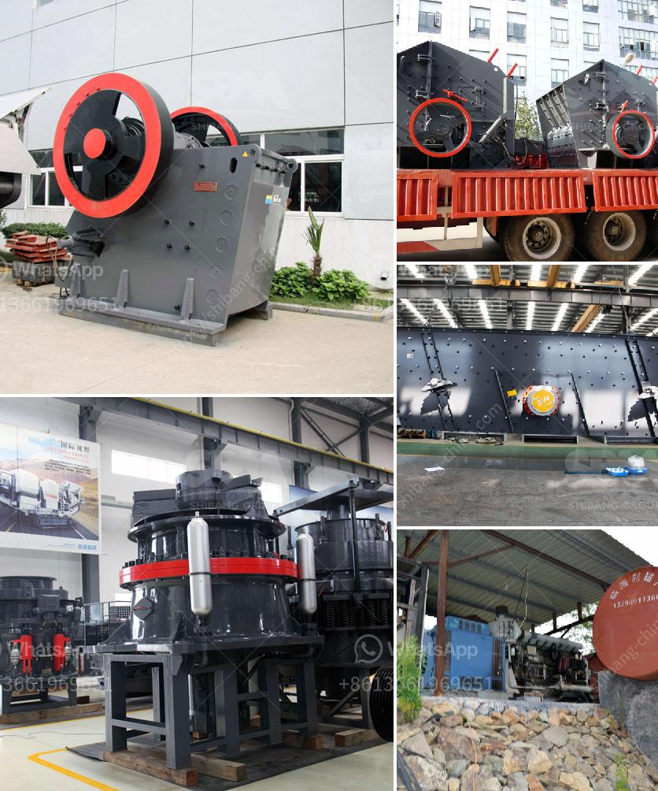

<h3>stone crushet 10 tons</h3>
The stone crusher is a heavy-duty machine that crushes and reduces stones into smaller pieces. With its powerful engine, it is capable of crushing up to 10 tons of stones per hour. This machine is ideal for construction companies or contractors who want to recycle their leftover stones from various construction sites, which can save additional expenses and fuel.

One of the key features of the stone crusher is its ability to crush stones of different sizes, ranging from 0mm to 80mm. This flexibility makes it suitable for a wide range of applications, such as road base, drainage, landscaping, and concrete aggregates. It can crush various types of stones, including granite, limestone, quartz, and even iron ore.

The stone crusher is equipped with a vibrating feeder, jaw crusher, impact crusher, cone crusher, vibrating screens, and belt conveyors. Its design allows quick installation and easy transportation from one site to another. It can crush and screen a wide range of materials efficiently, ensuring high productivity and low operating costs.

Furthermore, the stone crusher is designed to be environmentally friendly. It features a dust suppression system that minimizes dust emissions during the crushing process. This helps to protect the environment and ensures a healthier working environment for the machine operators.

In conclusion, the stone crusher is a powerful machine that provides an efficient solution for crushing stones. With its robust construction, versatility, and environmentally friendly features, it offers a cost-effective way for construction companies to recycle their waste materials. Whether it is for road construction, landscaping, or concrete production, the stone crusher consistently delivers high-quality crushed stones, providing value and sustainability to any project.
<h3>Contact us</h3><ul><li><strong>Whatsapp:&nbsp;<a href="https://wa.me/8613661969651">+8613661969651</a></strong></li><li><a href="https://swt.shibang-china.com/?git&amp;zhl&amp;stone crushet 10 tons"><strong>Online Service(chat now)</strong></a></li></ul><h3>Related</h3><ul><li><a href='gravel crushing machine in ethiopia.md'>gravel crushing machine in ethiopia</a></li><li><a href='slag quarry equipments supplies in algeria.md'>slag quarry equipments supplies in algeria</a></li><li><a href='machine grinds talcum powder.md'>machine grinds talcum powder</a></li><li><a href='quarrying crusher machine.md'>quarrying crusher machine</a></li><li><a href='used excavators prices in uae.md'>used excavators prices in uae</a></li></ul>