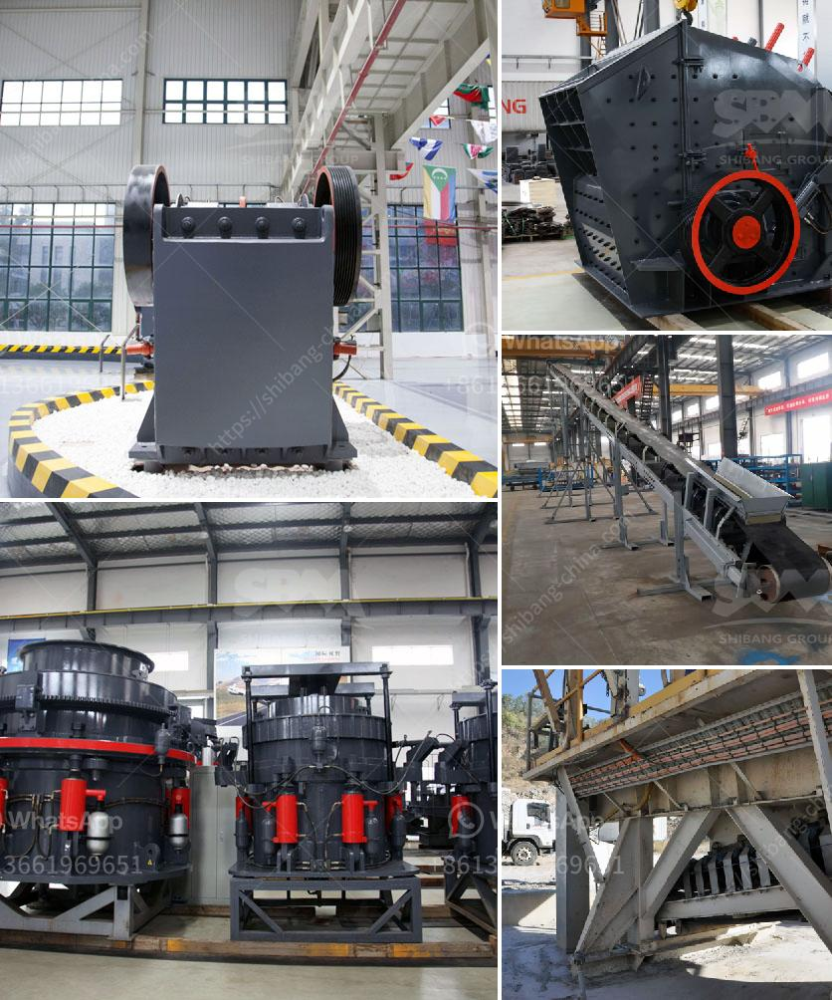

<h3>stone crushing equipment price in nigeria</h3>
Nigeria has a vast amount of untapped mineral resources. However, mining Nigeria is not very popular before. With the introduction of stone crushing equipment, such as jaw crusher, cone crusher and impact crusher, the mining industry has been rapidly developed in Nigeria. Moreover, the demand for crushed stones and other mining materials is increasing in the country. This has led to a surge in the stone crushing equipment price in Nigeria.

Stone crushing equipment is used for crushing stones or rocks into smaller pieces to make them suitable for various construction activities. Crushing rocks into specific sizes not only increases their usability but also reduces transportation costs and minimizes environmental impact. The price of stone crushing equipment in Nigeria varies depending on the capacity, brand, and specifications of the equipment.

One of the primary factors influencing the stone crushing equipment price is the brand popularity. Different brands have different prices due to their brand reputation and customer perception. Big brands like Caterpillar, Komatsu, and Sandvik have a higher market share and charge premium prices for their equipment. However, there are also smaller local brands that offer more affordable options for those with a lower budget.

Another key aspect that affects the stone crushing equipment price in Nigeria is the capacity or production efficiency. Different types of crushers have different capacities, ranging from a few tons to hundreds of tons per hour. The larger the capacity, the higher the price tag. High-capacity crushers are preferred by large-scale mining companies or contractors who require large amounts of crushed stones for their projects.

Furthermore, the specifications of the stone crushing equipment also play a crucial role in determining its price. Some equipment comes with additional features like automatic feeding systems, multiple crushing chambers, or adjustable settings. These advanced features can make the equipment more efficient and increase its price. On the other hand, basic models with standard features are more affordable for those with a limited budget.

Besides equipment price, buyers in Nigeria should also consider the after-sales service and spare parts availability. Stone crushing equipment is a long-term investment, and regular maintenance is essential to ensure its smooth operation. Finding a supplier with a strong after-sales support system and readily available spare parts can save you a lot of time and money in the long run.

In conclusion, the stone crushing equipment price in Nigeria is influenced by various factors such as brand, capacity, and specifications. Buyers should carefully evaluate their requirements and budget before making a purchasing decision. It is advisable to compare prices from different suppliers and consider the after-sales service to ensure a successful investment in stone crushing equipment. With the right choice of equipment, Nigeria can further develop its mining industry and contribute to its economic growth.
<h3>Contact us</h3><ul><li><strong>Whatsapp:&nbsp;<a href="https://wa.me/8613661969651">+8613661969651</a></strong></li><li><a href="https://swt.shibang-china.com/?git&amp;zhl&amp;stone crushing equipment price in nigeria"><strong>Online Service(chat now)</strong></a></li></ul><h3>Related</h3><ul><li><a href='set up a quarry business.md'>set up a quarry business</a></li><li><a href='how to build a stone crusher.md'>how to build a stone crusher</a></li><li><a href='river sand washing machine portable india.md'>river sand washing machine portable india</a></li><li><a href='equipment for gold refinery.md'>equipment for gold refinery</a></li><li><a href='limestone processing plant in benin.md'>limestone processing plant in benin</a></li></ul>