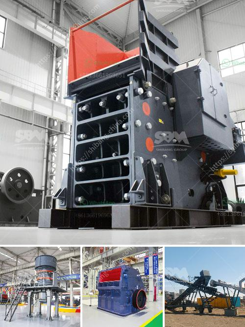

<h3>stone crushing machines south africa</h3>
Stone crushing machines in South Africa have been widely used in the mining industry for over 30 years. With the rapid development of the country's mining industry, South Africa's stone crushing machines have been welcomed to meet the local people's needs.

Stone crushing machines in South Africa mainly include jaw crushers, impact crushers, cone crushers, mobile crushers, etc. Nowadays, with the increasing demand for construction waste treatment, stone crushing machines have many types, such as small and medium-sized crushers, crawler mobile crushing stations, etc., which can fully meet the various needs of customers.

The stone crushing machines in South Africa are divided into two main categories: mobile stone crushing machines and stationary stone crushing machines. Mobile stone crushing machines are portable and easy to move, while stationary stone crushing machines are fixed in one place. Through continuous innovation and improvement, the performance and efficiency of stone crushing machines in South Africa have been significantly improved.

Stone crushing machines in South Africa play an important role in the mining industry, construction waste treatment, and aggregate production. They can crush large stones into smaller pieces for building materials, railway construction, highway construction, etc. The stone crushing machines in South Africa have many advantages, such as simple structure, high efficiency, low production cost, and convenient maintenance.

In addition, stone crushing machines in South Africa also have environmental protection advantages. The dust and noise pollution caused by these machines are relatively low, and the advanced dust collection and noise reduction devices have been widely used to protect the environment.

In conclusion, with the continuous development of South Africa's mining industry, stone crushing machines have become an essential equipment in the mining and construction industry. They have played an irreplaceable role in promoting the economic development of South Africa and improving the living standards of local people. The stone crushing machines in South Africa will continue to be popular in the future, and the market demand for them will continue to increase.
<h3>Contact us</h3><ul><li><strong>Whatsapp:&nbsp;<a href="https://wa.me/8613661969651">+8613661969651</a></strong></li><li><a href="https://swt.shibang-china.com/?git&amp;zhl&amp;stone crushing machines south africa"><strong>Online Service(chat now)</strong></a></li></ul><h3>Related</h3><ul><li><a href='small stone crusher price in india.md'>small stone crusher price in india</a></li><li><a href='gold ore rock processing equipment price.md'>gold ore rock processing equipment price</a></li><li><a href='price list of washing of rock phosphate.md'>price list of washing of rock phosphate</a></li><li><a href='italia crusher machine.md'>italia crusher machine</a></li><li><a href='portable sand screening machine philippines.md'>portable sand screening machine philippines</a></li></ul>