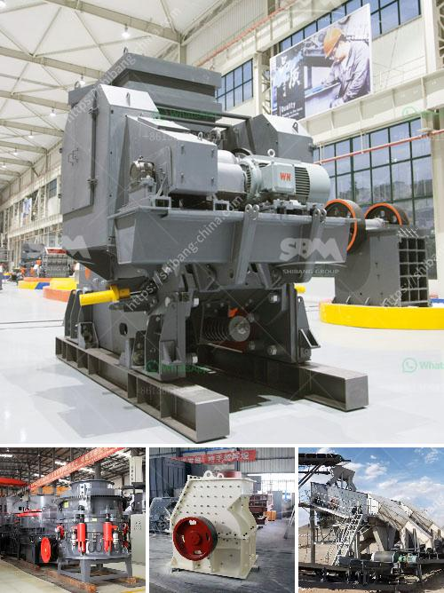

<h3>stone crushing making machine</h3>
Stone crushing machines are used to break down stones into smaller pieces capable of being used for various construction purposes such as roads, bridges, buildings, and railways. The machines create a crushing force through two jaw-like structures that move in a rotating motion to break down stones.

These machines are often utilized in quarries and mines to extract minerals and raw materials. The stones are initially loaded into a hopper where a vibrating feeder transports them to a jaw crusher. In the jaw crusher, the stones are crushed by pressing them against a stationary plate. This process continues until the stones are of the desired size.

The crushed stones then pass through a conveyor belt where they are further processed. In some machines, the stones are screened to separate out different sizes. The smaller stones may be used as aggregate in concrete and road construction, while larger stones are used as foundation stones for buildings.

The efficiency and performance of the stone crushing machine can be improved by closely monitoring the machine's operation and regularly maintaining it. Regular lubrication, checking wear and tear of the parts, and ensuring the machine is properly aligned can greatly extend its lifespan and enhance its productivity.

Stone crushing machines come in different sizes and configurations, depending on the nature of the stones they are intended to crush. Smaller machines may be more suitable for residential or small-scale construction projects, while larger machines are better suited for heavy-duty applications in large construction sites or mines.

In conclusion, stone crushing machines play an essential role in the construction industry by breaking down large rocks into smaller pieces that can be used for various construction purposes. Proper maintenance and operation of these machines ensure their efficiency and longevity, making them a valuable asset for any construction project.
<h3>Contact us</h3><ul><li><strong>Whatsapp:&nbsp;<a href="https://wa.me/8613661969651">+8613661969651</a></strong></li><li><a href="https://swt.shibang-china.com/?git&amp;zhl&amp;stone crushing making machine"><strong>Online Service(chat now)</strong></a></li></ul><h3>Related</h3><ul><li><a href='germany gypsum board manufacturing equipment.md'>germany gypsum board manufacturing equipment</a></li><li><a href='used stone crusher in pakistan.md'>used stone crusher in pakistan</a></li><li><a href='conveyor belt for sale in south africa.md'>conveyor belt for sale in south africa</a></li><li><a href='limestone impact mill price.md'>limestone impact mill price</a></li><li><a href='graphite manufacturing youtube.md'>graphite manufacturing youtube</a></li></ul>