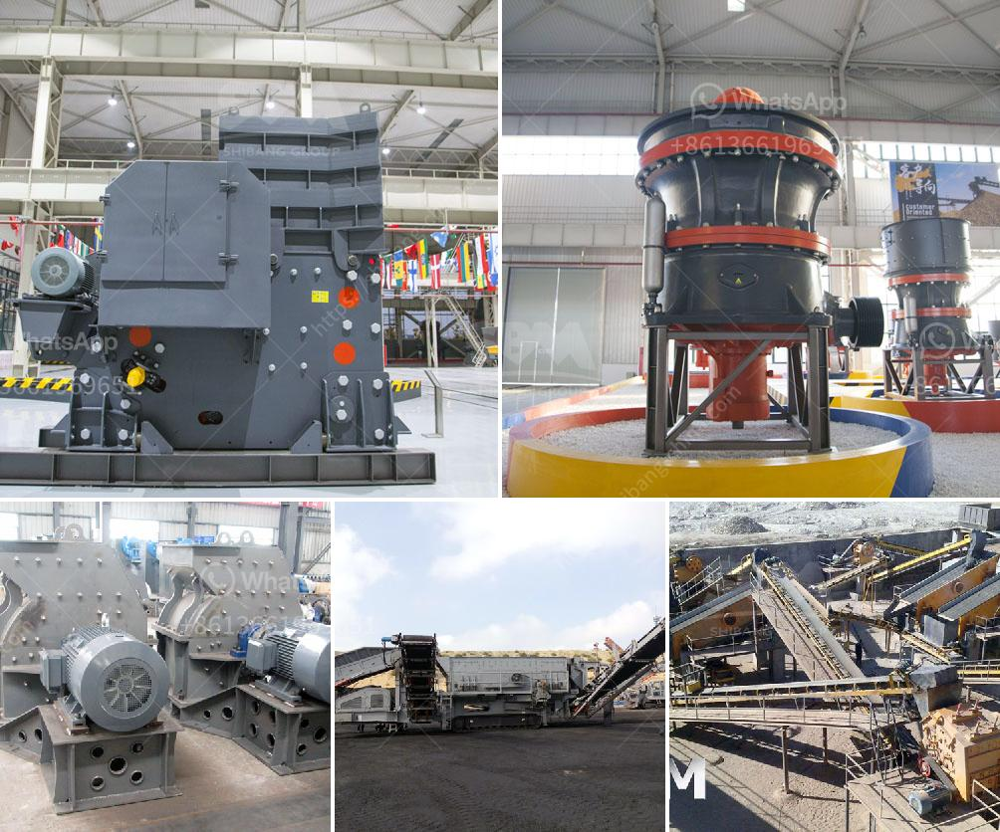

<h3>stone crushing plant electro plants</h3>
Stone crushing plants, also known as rock crushing plants, are essential factories used for crushing various types of stones into smaller pieces. These plants are considered to be one of the most efficient and effective ways to reduce size and improve the quality of the final product.

The stone crushing plant electro plants are specifically designed for crushing rocks and stones. They are equipped with advanced technology and high-quality machinery to ensure optimum productivity and efficiency. The plants are capable of crushing large rocks into small stones, which can be used for various purposes such as construction, landscaping, and road building.

One of the key components of the stone crushing plant electro plants is the crusher. The crusher is a machine that breaks down large rocks into smaller pieces, making them easier to transport and work with. There are different types of crushers available, including jaw crushers, impact crushers, and cone crushers. Each type of crusher has its own set of advantages and features, making it suitable for specific crushing applications.

In addition to the crusher, the stone crushing plant electro plants also include other components such as vibrating feeders, vibrating screens, and conveyors. These machines work together to ensure a continuous flow of rocks and stones throughout the crushing process. The vibrating feeders help in uniform feeding of rocks into the crusher, while the vibrating screens separate the crushed stones into different sizes.

The stone crushing plant electro plants are highly efficient and offer numerous benefits. Firstly, they help in reducing the size of rocks, making them easier to handle and transport. This saves time and effort, especially in large-scale construction projects. Secondly, the crushed stones produced by these plants are of high quality and can be used for various applications. They can be used as aggregates in concrete, for road construction, and for landscaping purposes.

Overall, stone crushing plant electro plants are essential for the construction industry as they provide a reliable and efficient method of crushing rocks and stones. These plants not only save time and effort but also help in improving the quality of the final product. With their advanced technology and high-quality machinery, they are a cost-effective solution for various crushing applications.
<h3>Contact us</h3><ul><li><strong>Whatsapp:&nbsp;<a href="https://wa.me/8613661969651">+8613661969651</a></strong></li><li><a href="https://swt.shibang-china.com/?git&amp;zhl&amp;stone crushing plant electro plants"><strong>Online Service(chat now)</strong></a></li></ul><h3>Related</h3><ul><li><a href='crushing plants in malaysia.md'>crushing plants in malaysia</a></li><li><a href='crusher supplier in saudi arabia.md'>crusher supplier in saudi arabia</a></li><li><a href='hydraulic cone crusher price.md'>hydraulic cone crusher price</a></li><li><a href='gold ore processing equipment manufacturer india.md'>gold ore processing equipment manufacturer india</a></li><li><a href='gypsum machinery plant from france.md'>gypsum machinery plant from france</a></li></ul>