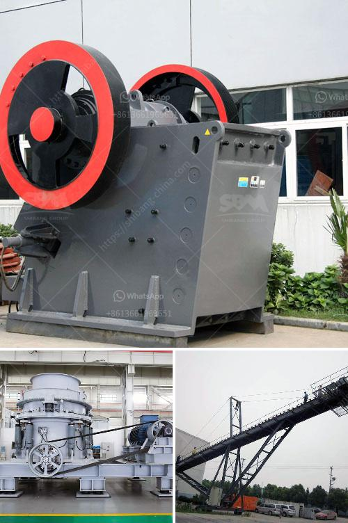

<h3>stone crushing plant keesara</h3>
Stone crushing plants are essential to the construction industry, as they produce the following materials used for various construction purposes:

1. Crushed Stone - This is the largest category of aggregates used in construction and road building. It is made from various mineral materials, such as limestone, granite, trap rock, and other durable rocks. Stone crushing plants crush these minerals into smaller sizes for further processing in construction industries.

2. Sand - Another important material produced by stone crushing plants is sand. Sand is used in various construction applications, including concrete production, mortar, and plastering. It is obtained by crushing large rocks and stones into smaller pieces.

3. Gravel - Gravel is commonly used in road construction as well as in the production of concrete. It is obtained by crushing rocks and stones, similar to sand and crushed stone. Gravel comes in different sizes and is sorted according to its intended use.

One such stone crushing plant located in Keesara, a suburb of Hyderabad, Telangana State in India, is the Keerara stone crushing plant. It is an imposing structure of immense strength that is made of reinforced concrete. With a total area of over 10 acres, this crushing plant provides multiple structures and machinery for processing stones and rocks.

One of the main components of this plant is the vibrating feeder, which is responsible for feeding the raw material into the primary crusher. The primary crusher in this plant is a powerful jaw crusher. It can process stones with a feed size up to 32 inches and delivers a crushing capacity of up to 800 tons per hour.

The crushed stones, which are of different sizes depending on the requirement, exit the primary crusher and are conveyed to various vibrating screens for further separation. These screens ensure that the stones are sorted into their respective sizes, such as 1/4 inch, 3/8 inch, 1/2 inch, and so on.

Once sorted, the stones are then conveyed through a series of conveyor belts that carry them to different storage piles for temporary storage. From these storage piles, the stones are further transported to the respective construction sites as per the demand.

The stone crushing plant in Keesara is known for its exceptional efficiency and high productivity. It is equipped with advanced technology and machinery, including the latest state-of-the-art crushers and screens. With a team of skilled workers and technicians, the plant operates smoothly and can produce high-quality crushed stones.

Moreover, the stone crushing plant in Keesara follows all the required safety protocols and environmental regulations. Dust suppression systems and water sprinklers are installed throughout the plant to mitigate dust pollution. Additionally, the plant has a soundproof enclosure to reduce noise pollution and ensure a peaceful working environment for the staff.

In conclusion, the stone crushing plant in Keesara is a crucial facility in the construction industry. With its advanced technology, high productivity, and adherence to safety and environmental standards, it plays a vital role in producing the materials required for various construction projects.
<h3>Contact us</h3><ul><li><strong>Whatsapp:&nbsp;<a href="https://wa.me/8613661969651">+8613661969651</a></strong></li><li><a href="https://swt.shibang-china.com/?git&amp;zhl&amp;stone crushing plant keesara"><strong>Online Service(chat now)</strong></a></li></ul><h3>Related</h3><ul><li><a href='conveyor belt laying procedure.md'>conveyor belt laying procedure</a></li><li><a href='concrete recycling crushing machine.md'>concrete recycling crushing machine</a></li><li><a href='portable cone crusher.md'>portable cone crusher</a></li><li><a href='stone crusher in ksa.md'>stone crusher in ksa</a></li><li><a href='prices of stone crusher.md'>prices of stone crusher</a></li></ul>