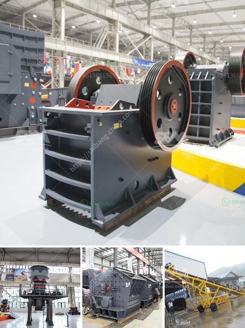

<h3>stone crushing plant use jaw crusher price list</h3>
Stone crushing plant use jaw crusher price list is an important factor for clients to choose the suitable processing crusher equipment. Providing clients high quality and low cost stone crusher is our main principle. Based on the abundant experience and high technology, our products are welcomed by the world-wide customers.

Jaw crusher is widely used in various materials processing of mining &construction industries, such as it is suit for crushing granite, marble, basalt, limestone, quartz, cobble, iron ore, copper ore, and some other mineral &rocks. It can be described as obbligato machine in mining, building construction, construction wastes crushing, Hydropower and Water Resource, railway and highway construction and some other industries.

Jaw crusher is widely used in the works of mine, smelting, building materials, road, railway, irrigation, chemical industry, etc. The crusher is ideally primary crushing and secondary crushing. We provide PE jaw crusher for sale. Flotation Production Line can generate different specifications of stone particles through special crushing cavity composed of movable jaw plate and fixed jaw plate.

Jaw crusher has a competitive advantage in the stone crushing plant use. It is the essential mining equipment for mining and construction. Moreover, our jaw crusher price list is reasonable and affordable which is really beneficial for clients. If you want to know more about jaw crusher price, please feel free to contact us!
<h3>Contact us</h3><ul><li><strong>Whatsapp:&nbsp;<a href="https://wa.me/8613661969651">+8613661969651</a></strong></li><li><a href="https://swt.shibang-china.com/?git&amp;zhl&amp;stone crushing plant use jaw crusher price list"><strong>Online Service(chat now)</strong></a></li></ul><h3>Related</h3><ul><li><a href='dolomite crushing plant.md'>dolomite crushing plant</a></li><li><a href='complete stone quarry plant.md'>complete stone quarry plant</a></li><li><a href='formula de capacidad de chancadora.md'>formula de capacidad de chancadora</a></li><li><a href='cement plant cost estimation.md'>cement plant cost estimation</a></li><li><a href='pakistan directory of cement plants list pdf.md'>pakistan directory of cement plants list pdf</a></li></ul>