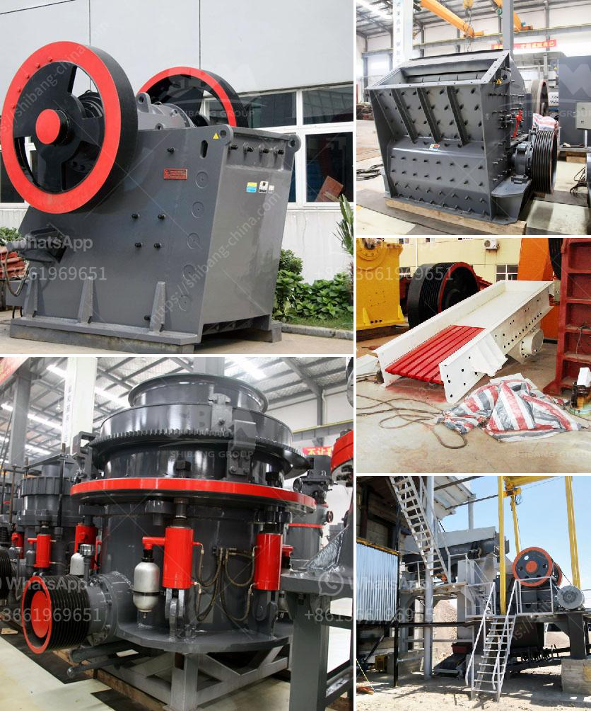

<h3>stone crushing plants close to rotate</h3>
Stone crushing plants are an essential industry in the construction and road building sectors. These plants, also called crushing machines, are responsible for breaking down large rocks and stones into smaller materials that can be used for various purposes such as concrete production, road base, and drainage aggregates.

One crucial component of stone crushing plants is the rotating machinery. These machines, typically powered by a motor, rotate large steel drums or cylinders, causing the rocks and stones to break against each other. This process is known as crushing, and it results in the production of smaller-sized materials.

The rotating machinery in stone crushing plants operates in a continuous cycle. The rocks or stones are fed into the machine from a hopper or conveyor belt, and the drums start rotating to crush them. As the rocks break, smaller pieces fall through the gaps between the rotating drums and are collected in separate compartments. These smaller materials are then used for various construction purposes.

The rotation speed of the machinery in stone crushing plants is carefully controlled to achieve optimal crushing results. Too high a rotation speed can lead to excessive wear and tear on the machine components, resulting in reduced efficiency and increased maintenance requirements. On the other hand, too slow a rotation speed can result in poor crushing performance, causing the plant to produce substandard materials.

Stone crushing plants are typically equipped with safety measures to prevent accidents and protect workers. The rotating machinery is enclosed in sturdy metal casings to prevent any flying debris. Additionally, emergency stop buttons are strategically placed near the machinery so that operators can quickly shut down the plant in case of any issues.

Regular maintenance and inspections are crucial to ensure the proper functioning of the rotating machinery in stone crushing plants. The drums and other components are checked for signs of wear and tear, and any necessary replacements or repairs are carried out promptly. Lubrication of the moving parts is also essential to reduce friction and increase the lifespan of the machinery.

In conclusion, stone crushing plants play a vital role in the construction and road building industries. The rotating machinery in these plants is responsible for breaking down large rocks and stones into smaller materials that can be used for construction purposes. The machinery operates in a continuous cycle, with the rotation speed carefully controlled to achieve optimal crushing results. However, proper maintenance and inspections are essential to keep the machinery in good working condition and ensure the safety of the workers.
<h3>Contact us</h3><ul><li><strong>Whatsapp:&nbsp;<a href="https://wa.me/8613661969651">+8613661969651</a></strong></li><li><a href="https://swt.shibang-china.com/?git&amp;zhl&amp;stone crushing plants close to rotate"><strong>Online Service(chat now)</strong></a></li></ul><h3>Related</h3><ul><li><a href='ulltra fine grinding mill.md'>ulltra fine grinding mill</a></li><li><a href='crusher and screening plants for sale.md'>crusher and screening plants for sale</a></li><li><a href='jaw crusher machine for sale.md'>jaw crusher machine for sale</a></li><li><a href='how to start stone crusher unit in kenya.md'>how to start stone crusher unit in kenya</a></li><li><a href='portable crushing plants for sale western cape.md'>portable crushing plants for sale western cape</a></li></ul>