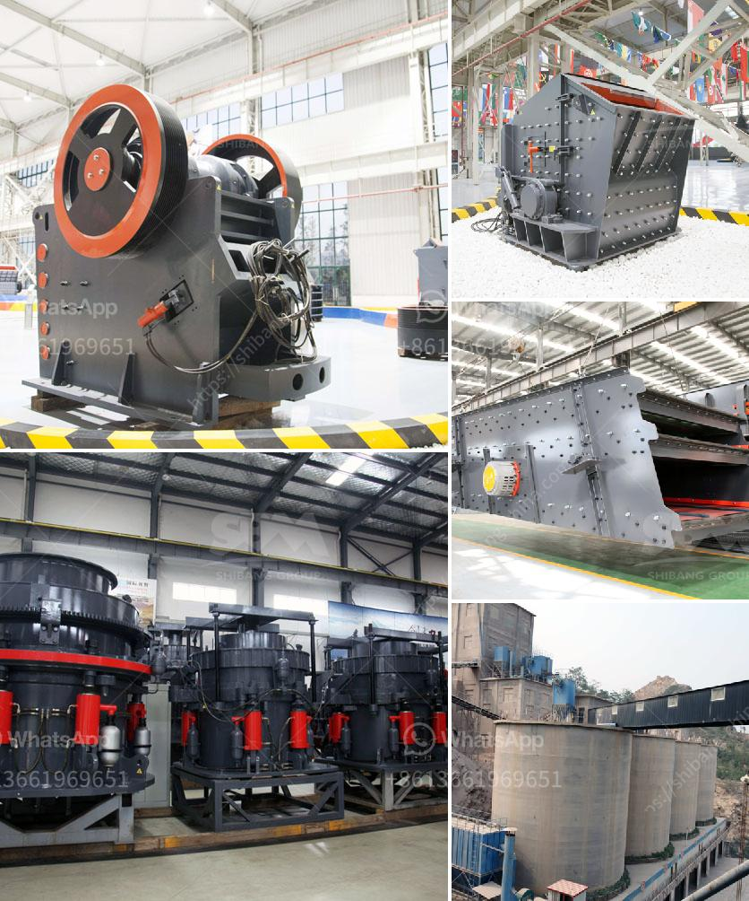

<h3>stone crushing system</h3>
Stone crushing system plays an integral role in the construction industry as it reduces large-sized stones into smaller pieces to be used as gravel or decorative materials. The system is comprised of various components that work together for efficient and effective stone crushing.

Firstly, the feeder system allows large-sized stones to be evenly and continuously fed into the jaw crusher. This ensures a consistent flow of stones into the crushing chamber, preventing any overload and enhancing the overall productivity of the system. The feeder system is designed to handle heavy loads and withstand the abrasive nature of the stones.

Secondly, the jaw crusher is the primary crushing equipment in the stone crushing system. It is responsible for reducing the size of the stones into smaller pieces that can be used for various purposes. The jaw crusher is designed with a high reduction ratio, ensuring efficient crushing of even the toughest materials. It is also equipped with a durable jaw plate that can withstand the constant wear and tear caused by the crushing process.

Thirdly, the vibrating screen separates the crushed stones into different sizes. This allows for more flexibility in using the crushed materials for different applications. The vibrating screen is equipped with multiple decks that can separate the stones into various sizes, ensuring that only the desired sizes are used.

Lastly, the conveyor system transports the crushed stones to their respective destinations. This eliminates the need for manual handling, reducing the risk of injuries and improving overall efficiency. The conveyor system is designed to handle heavy loads and can be customized to fit the specific needs of the stone crushing system.

In conclusion, the stone crushing system is an important part of the construction industry that reduces large-sized stones into smaller pieces. It consists of various components that work together to achieve efficient and effective stone crushing. The system is designed to handle heavy loads and is equipped with durable components that can withstand the abrasive nature of the stones. With its ability to produce various sizes of crushed stones, the system enhances the versatility and productivity of the construction industry.
<h3>Contact us</h3><ul><li><strong>Whatsapp:&nbsp;<a href="https://wa.me/8613661969651">+8613661969651</a></strong></li><li><a href="https://swt.shibang-china.com/?git&amp;zhl&amp;stone crushing system"><strong>Online Service(chat now)</strong></a></li></ul><h3>Related</h3><ul><li><a href='cement mill startup procedures.md'>cement mill startup procedures</a></li><li><a href='granite machine concrete.md'>granite machine concrete</a></li><li><a href='crawler mobile crushing plants.md'>crawler mobile crushing plants</a></li><li><a href='conveyor belt manufacturers in kolkata.md'>conveyor belt manufacturers in kolkata</a></li><li><a href='how to start stone crusher unit in kenya.md'>how to start stone crusher unit in kenya</a></li></ul>