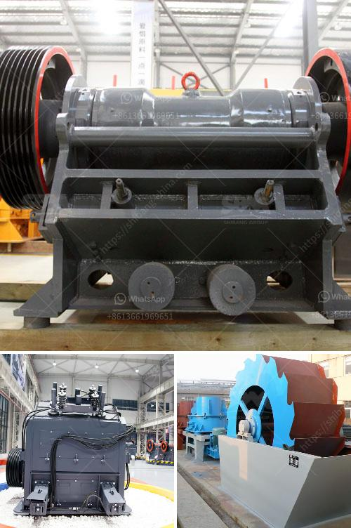

<h3>stone grinding roller mill for sale</h3>
Stone grinding roller mill is a type of grinder used to grind materials into extremely fine powder for use in mineral dressing processes, paints, pyrotechnics, ceramics, and selective laser sintering. The roller mill is a highly efficient and energy-saving grinding equipment that adopts advanced technology at home and abroad and combines the specific industrial and mining conditions of the domestic milling industry.

The stone grinding roller mill for sale is a new generation of product developed by our company on the basis of traditional mill. With advanced technology and modern production concept, it has outstanding advantages in production efficiency, energy consumption, environmental protection, and product performance. The equipment has the characteristics of high grinding efficiency, low energy consumption, large feed particle size, and easy adjustment of product fineness.

The stone grinding roller mill for sale is composed of a main machine, a material analyzer, a blower, a finished cyclone separator, a jaw crusher, a bucket elevator, an electromagnetic vibrating feeder, and an electric control motor. The entire grinding system is tightly sealed and operates under negative pressure, so there is no dust overflowing.

The roller mill is mainly used for grinding mineral products in industries such as metallurgy, building materials, chemical industry, mining, etc. It can process various non-flammable and explosive materials with Mohs hardness below 9.3 and humidity below 6%, such as gypsum, talc, calcite, limestone, marble, barite, dolomite, granite, kaolin, bauxite, rock phosphate, coal and other materials.

Compared with the traditional Raymond mill and ball mill, the stone grinding roller mill has the following advantages:

1. High grinding efficiency: The grinding roller is tightly rolled on the grinding ring under the action of centrifugal force, so the grinding efficiency is higher than that of the Raymond mill and ball mill.

2. Energy-saving and environmental protection: The roller mill adopts a new type of classifier, which can greatly improve the production efficiency and reduce the energy consumption of the system. In addition, the equipment is equipped with a pulse dust collector, which can effectively collect dust and protect the environment.

3. Wide range of applications: The stone grinding roller mill can process a wide range of materials, including minerals with Mohs hardness below 9.3, such as grinding quartz, feldspar, calcite, talc, barite, fluorite, rare earth, marble, ceramic, bauxite, manganese ore, iron ore, copper ore, phosphate rock, ferric oxide red, zircon sand, slag, water slag, cement clinker, activated carbon, dolomite, granite, garnet, iron oxide yellow, bean cake, chemical fertilizer, compound fertilizer, fly ash, bituminous coal, coking coal, lignite, humic acid, etc.

In summary, the stone grinding roller mill for sale is an ideal equipment for grinding minerals. With its excellent performance and wide range of applications, it has been widely used in the fields of metallurgy, building materials, chemical industry, mining, etc. It not only improves the efficiency of production but also reduces the consumption of energy and protects the environment. If you are interested in purchasing a stone grinding roller mill, please contact us for more information.
<h3>Contact us</h3><ul><li><strong>Whatsapp:&nbsp;<a href="https://wa.me/8613661969651">+8613661969651</a></strong></li><li><a href="https://swt.shibang-china.com/?git&amp;zhl&amp;stone grinding roller mill for sale"><strong>Online Service(chat now)</strong></a></li></ul><h3>Related</h3><ul><li><a href='professional granite cone crusher.md'>professional granite cone crusher</a></li><li><a href='coal crusher manufacturer.md'>coal crusher manufacturer</a></li><li><a href='roller mill for mantles.md'>roller mill for mantles</a></li><li><a href='used equipment ball mill sale.md'>used equipment ball mill sale</a></li><li><a href='gold ore rock processing equipment price.md'>gold ore rock processing equipment price</a></li></ul>