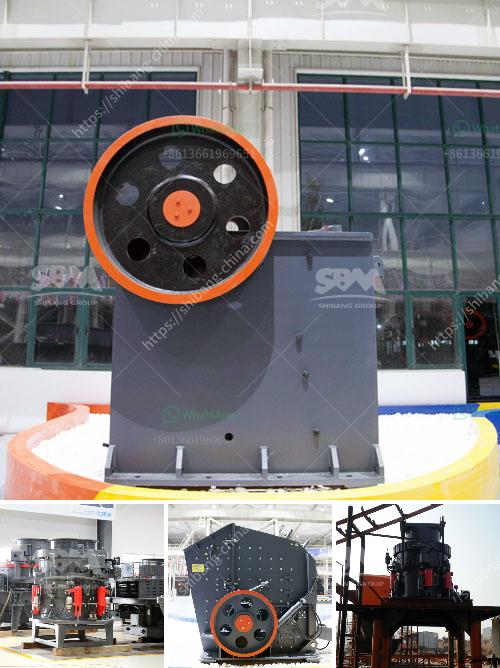

<h3>stone hammer mill</h3>
A stone hammer mill is a machine used to shred or crush materials into smaller pieces. This mighty machine is perfect for businesses and industries that deal with raw materials in large quantities. It is designed to convert these materials into a fine powder, which can be used in various applications such as construction, manufacturing, and agriculture.

The stone hammer mill consists of several components, including a hopper, a crushing chamber, rotating hammers, and a discharge outlet. The raw material is fed into the hopper, which then leads to the crushing chamber. Inside the chamber, the rotating hammers pound and grind the material until it reaches the desired size. Once the material is ground, it is discharged through the outlet for further processing or packaging.

One of the key advantages of using a stone hammer mill is its versatility. It can handle a wide range of materials, including coal, limestone, gypsum, ores, and even glass. This makes it an ideal grinding machine for various industrial applications. For instance, in the construction industry, stone hammer mills are commonly used to pulverize concrete and other materials for recycling purposes.

Another advantage of the stone hammer mill is its efficiency in grinding. The rotating hammers generate a high impact force, which minimizes energy loss during the grinding process. This means that more of the input energy is used for grinding, resulting in a faster and more efficient operation. Additionally, the adjustable speed settings of the machine allow for precise control over the particle size of the output.

In the manufacturing industry, stone hammer mills are commonly used to grind raw materials for the production of ceramics, paints, and other products. The fine powder produced by these machines can be easily mixed with binders and additives to create a homogeneous mixture for further processing. This increases the efficiency and quality of the manufacturing process, leading to better end products.

Furthermore, stone hammer mills find applications in the agricultural sector. They can be used to grind grains, such as corn, wheat, and barley, into fine flour. This enables farmers and feed manufacturers to produce high-quality animal feed, ensuring the health and productivity of livestock. Stone hammer mills can also be used for grinding wood chips or biomass materials, which can then be used as fuel or raw material for other processes.

In conclusion, a stone hammer mill is a versatile grinding machine that offers numerous applications in various industries. Its ability to handle a wide range of materials, coupled with its high grinding efficiency, makes it a valuable asset for businesses dealing with bulk raw materials. Whether in construction, manufacturing, or agriculture, this powerful machine delivers consistent and reliable results, contributing to the overall productivity and profitability of the industry.
<h3>Contact us</h3><ul><li><strong>Whatsapp:&nbsp;<a href="https://wa.me/8613661969651">+8613661969651</a></strong></li><li><a href="https://swt.shibang-china.com/?git&amp;zhl&amp;stone hammer mill"><strong>Online Service(chat now)</strong></a></li></ul><h3>Related</h3><ul><li><a href='gold processing methods iron slag.md'>gold processing methods iron slag</a></li><li><a href='italia crusher machine.md'>italia crusher machine</a></li><li><a href='how to pulverized limestone crusher.md'>how to pulverized limestone crusher</a></li><li><a href='mobile crusher machine in iran.md'>mobile crusher machine in iran</a></li><li><a href='gravel crushing machine in ethiopia.md'>gravel crushing machine in ethiopia</a></li></ul>