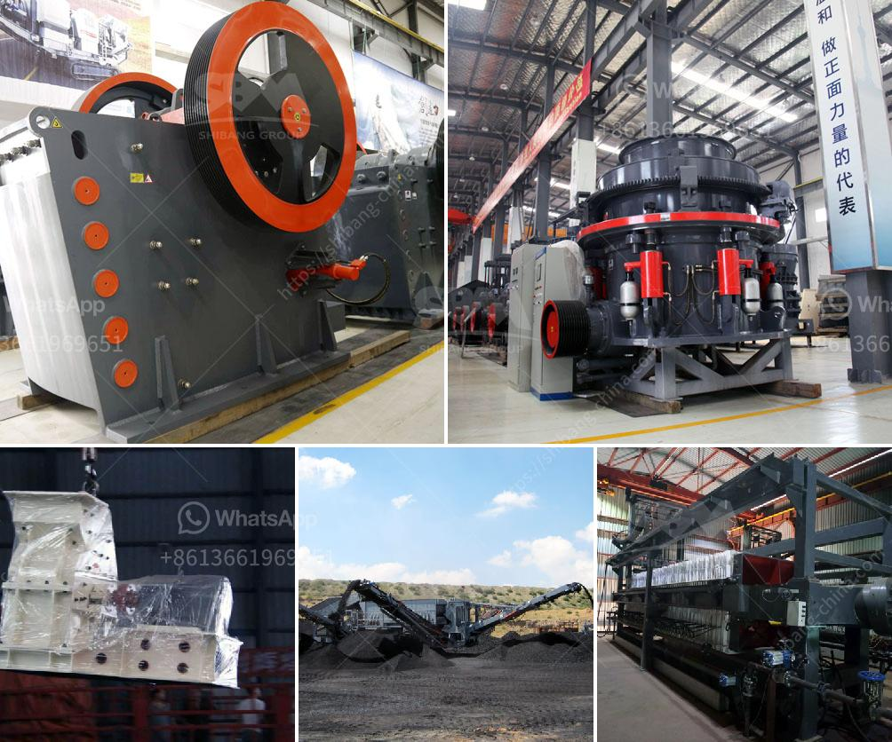

<h3>stone mill grinder for sale</h3>
In a world dominated by industrial processes, stone mill grinders bring back age-old techniques to produce quality flour and grains. With a plethora of options available for sale today, this guide aims to help you navigate through the key considerations in selecting the perfect stone mill grinder for your needs.

Stone mill grinders have been used for centuries to grind grains and produce flour. These mills utilize two large stones – one stationary and one rotating – to grind the grains. The grinding process creates heat, which can affect the flavor and nutritional value of the grains. However, stone mill grinders excel in preserving the natural nutrients and flavors, resulting in healthier and tastier flour.

1. Size and Capacity: Assess your milling needs and select a stone mill grinder with an appropriate size and capacity. Consider whether you need a small domestic mill or a larger commercial-grade one.

2. Material: Look for mills made from high-quality, durable materials, such as granite or natural stones. These materials provide excellent durability and ensure a consistent grind.

3. Manual or Electric: Decide whether you prefer a manual or electric stone mill grinder. Manual models require physical effort to grind the grains, while electric models ease the process but require a power source.

4. Adjustable Grind Settings: Opt for a grinder that allows you to adjust the coarseness or fineness of the grind. This feature enables more versatility in cooking and baking.

5. Maintenance: Consider the ease of upkeep and cleaning. Look for models with removable parts, making it easier to clean and maintain the grinder.

Investing in a stone mill grinder provides a range of benefits. Firstly, stone grinding preserves the natural nutrients and flavor of grains, ensuring a more wholesome and tastier final product. Secondly, these grinders offer greater control over the desired consistency of the grind, allowing you to utilize the flour for various recipes. Lastly, the durability and longevity of stone mill grinders make them a sustainable and eco-friendly choice for individuals and businesses alike.

When searching for a stone mill grinder for sale, understanding the various factors involved will enable you to make an informed decision. Consider the size, capacity, material, grind settings, and maintenance requirements to find the perfect mill that meets your needs, ensuring delicious and nutritious flour for years to come.
<h3>Contact us</h3><ul><li><strong>Whatsapp:&nbsp;<a href="https://wa.me/8613661969651">+8613661969651</a></strong></li><li><a href="https://swt.shibang-china.com/?git&amp;zhl&amp;stone mill grinder for sale"><strong>Online Service(chat now)</strong></a></li></ul><h3>Related</h3><ul><li><a href='stone quarry business proposal.md'>stone quarry business proposal</a></li><li><a href='hydrated lime powder making machine from germany.md'>hydrated lime powder making machine from germany</a></li><li><a href='sand washing plant for sale in uae.md'>sand washing plant for sale in uae</a></li><li><a href='dolomite crushing plant.md'>dolomite crushing plant</a></li><li><a href='sand making machine in south africa.md'>sand making machine in south africa</a></li></ul>