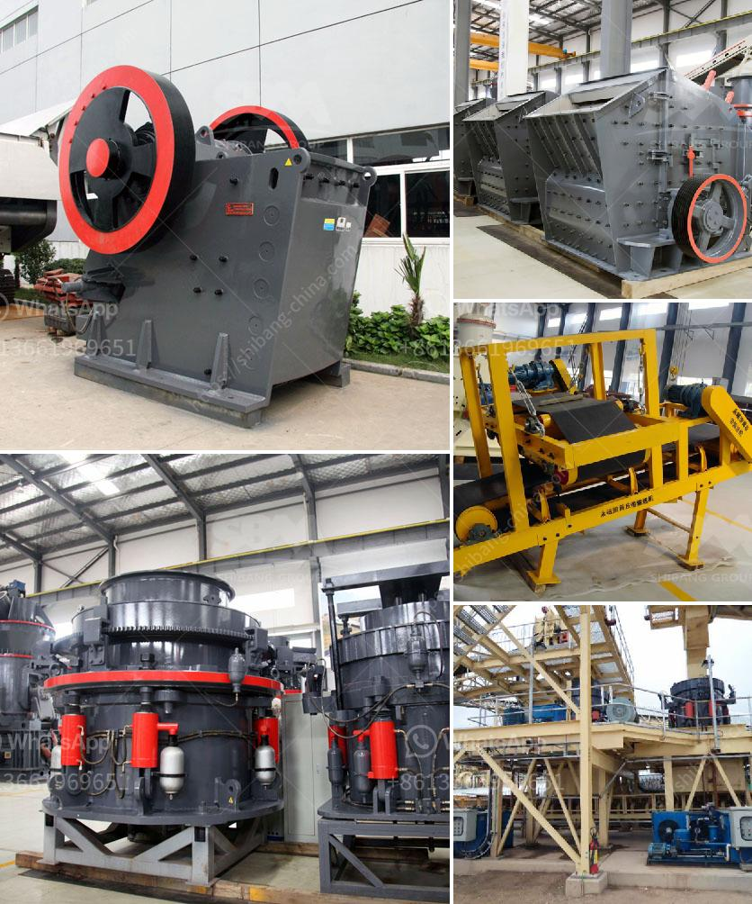

<h3>stone quarry crusher equipment</h3>
Stone quarry crusher equipment is widely used in crushing granite, basalt, limestone, river pebbles, dolomite, bluestone, and other rocks. It is commonly used in quarry, gravel, building materials, road, railway, water conservancy and chemical industries. The capacity of quarry crusher equipment can range from 50 to 1800 tons per hour. The raw materials are generally crushed in the first stage and then transported to the processing plant.

Quarry crusher equipment is the aggregate production equipment, it is widely applied in mining, metallurgical,construction, hydraulic and chemical industries. Put simply, crushing aggregate is the process of making little ones out of big ones. The main reason why crushers are used in the quarrying industry is that they reduce the size of rocks and stones, making them easier to transport.

Various types of crushers are used in the stone crushing industry such as Jaw Crushers, Roller Crushers, Cone Crushers, Impactor, Rotopoctor, etc. Generally, only Jaw crushers are used as primary crushers. For secondary and tertiary crushing application either of Jaw, cone, roller, Impactor or Rotopoctor type crushers are used. Various types of crushers are briefly described below:

- Jaw Crushers: These crushers are usually used for the first stage of crushing. They reduce rocks and stones to smaller sizes for the next stage.

- Cone Crushers: These crushers are used to crush rocks and ores for ore processing and for the creation of gravel.

- Impactor Crushers: Impactors are designed for crushing hard to soft materials like limestone, iron ore, coal, etc. These impactors are available in various sizes ranging from 400 mm to 1200 mm diameter and width upto 2000 mm. Star trace can offer duty impactors, specially designed for coal and similar materials.

- Roller Crushers: This crusher is composed of two cylinders rotating in opposite directions around two parallel axes.

Quarry crusher equipment is being developed with the objective of enabling crushing operations to produce more with less energy consumption, more uniform product size and increased capacity and reliability. There are several key components with the unique function installed on the equipment to improve its performance. Each manufacturer has its own advantages and characteristics, so the price of quarry crusher equipment is different.

To get a higher productivity, better reliability, and flexibility, longer service life, and better final product quality, experts from SBM specialize in the research and development of quarry crusher equipment. It adopts the most advanced crushing technology and manufacturing materials with a high reduction ratio, high capacity, low power consumption, and uniform finished product size.

In conclusion, stone quarry crusher equipment line is mainly composed of vibrating feeder, jaw crusher, impact crusher, vibrating screen, belt conveyor, and electric control system, etc. It is designed to meet the crushing demands of various customers. Many factories have made significant improvements to the old stone quarry crusher equipment to increase its productivity and reduce its noise and dust. The most notable feature of modern quarry crusher equipment is the integration of receiving, crushing, transmission, and screening, which provides flexibility in handling a wide range of crushed stone applications.
<h3>Contact us</h3><ul><li><strong>Whatsapp:&nbsp;<a href="https://wa.me/8613661969651">+8613661969651</a></strong></li><li><a href="https://swt.shibang-china.com/?git&amp;zhl&amp;stone quarry crusher equipment"><strong>Online Service(chat now)</strong></a></li></ul><h3>Related</h3><ul><li><a href='calcium carbonate powder mill price.md'>calcium carbonate powder mill price</a></li><li><a href='feldspar grinding machine manufacturers in india.md'>feldspar grinding machine manufacturers in india</a></li><li><a href='consol glass recycling price list south africa.md'>consol glass recycling price list south africa</a></li><li><a href='rent stone crusher in gresik.md'>rent stone crusher in gresik</a></li><li><a href='coal crushing and screening plant in south africa.md'>coal crushing and screening plant in south africa</a></li></ul>