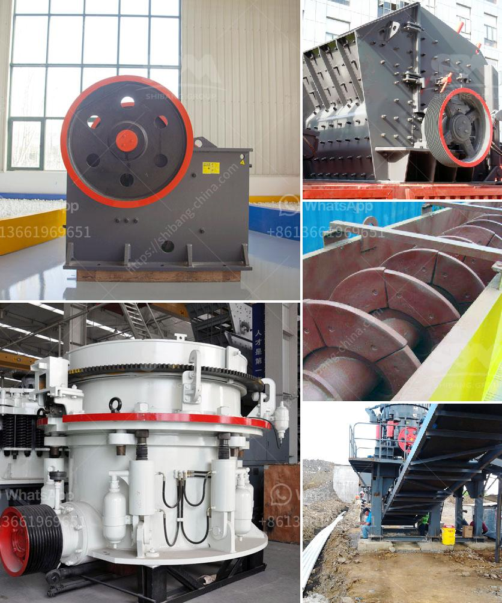

<h3>super fine grinding mills</h3>
Super fine grinding mills are advanced technology-driven mills that are primarily used for finely grinding various minerals and industrial substances. These mills are capable of producing particles sizes ranging from a few micrometers to a few nanometers, making them ideal for applications requiring extreme fineness.

One of the key advantages of super fine grinding mills is their ability to produce uniform particle sizes. Unlike traditional mills that often result in uneven particle distribution, these mills utilize precision mechanisms to ensure consistent product quality. This uniformity is crucial in industries such as pharmaceuticals, cosmetics, and food processing, where precise particle size distribution is essential for product effectiveness and quality.

Super fine grinding mills also offer increased efficiency. With their fine grinding capabilities, these mills can reduce the energy consumption required for grinding by up to 50%. This not only leads to cost savings but also helps reduce carbon emissions, making them an eco-friendly choice for industries looking to reduce their environmental impact.

Furthermore, super fine grinding mills offer a wide range of customization options. Manufacturers can easily adjust the mill's settings to suit different products and desired particle sizes. This flexibility allows industries to develop new formulations and optimize their processes, ensuring maximum product quality.

In summary, super fine grinding mills are revolutionizing the way industries process minerals and industrial substances. Their ability to produce ultra-fine particles, uniform particle sizes, increased efficiency, and customization options make them a valuable asset for various sectors. As technology advances, we can expect super fine grinding mills to become even more efficient and versatile, further transforming industries that rely on precise particle size distribution for their products.
<h3>Contact us</h3><ul><li><strong>Whatsapp:&nbsp;<a href="https://wa.me/8613661969651">+8613661969651</a></strong></li><li><a href="https://swt.shibang-china.com/?git&amp;zhl&amp;super fine grinding mills"><strong>Online Service(chat now)</strong></a></li></ul><h3>Related</h3><ul><li><a href='advances in hammer mills.md'>advances in hammer mills</a></li><li><a href='how to build a gold washing plant.md'>how to build a gold washing plant</a></li><li><a href='cone crusher for sale in ghana.md'>cone crusher for sale in ghana</a></li><li><a href='stone crusher price.md'>stone crusher price</a></li><li><a href='mini cement plant tons per day.md'>mini cement plant tons per day</a></li></ul>