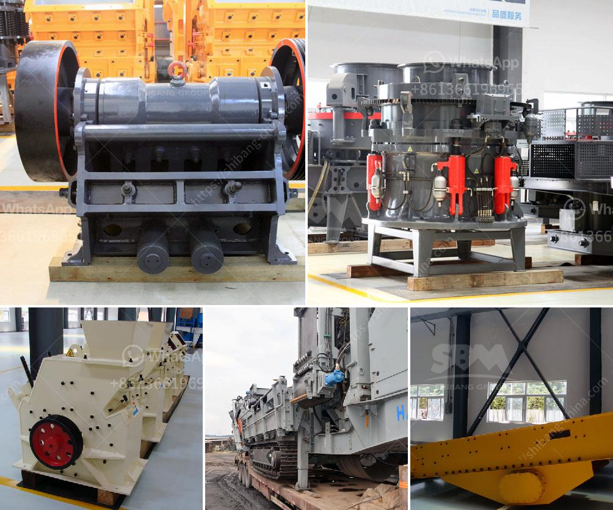

<h3>super fine powder grinder</h3>
Are you tired of spending hours trying to grind your herbs or spices with a traditional mortar and pestle? Look no further than the super fine powder grinder. With its efficient design and powerful performance, this grinder is a game-changer for anyone in need of finely ground ingredients.

The super fine powder grinder is a versatile machine that can be used for grinding a wide range of materials. From spices and herbs to grains and even coffee beans, this grinder can handle it all. Its sleek design and compact size make it a perfect addition to any kitchen countertop.

One of the key features of this grinder is its powerful motor. With a high-speed motor, it can quickly and efficiently grind even the toughest ingredients. Say goodbye to lumpy spices or unevenly ground coffee beans. The super fine powder grinder ensures a consistently smooth and fine grind every time.

Another noteworthy aspect of this grinder is its ability to produce an ultra-fine powder. Whether you are grinding spices for a flavorful curry or creating your own homemade powdered sugar, this grinder can achieve the perfect consistency. It is ideal for those who seek a professional-grade finish in their culinary creations.

The super fine powder grinder also offers a user-friendly experience. Its easy-to-use control panel allows you to adjust the grinding time and speed according to your specific needs. Simply load your ingredients, set the desired time and speed, and let the grinder do the rest. No more tedious grinding or manual labor – this grinder takes care of it all.

Not only does the super fine powder grinder save you time and effort, but it also preserves the flavor and aroma of your ingredients. By grinding your spices or herbs just before use, you ensure that their essential oils and flavors are at their peak. This guarantees a more intense and enjoyable culinary experience.

In terms of maintenance, this grinder is a breeze to clean. Its detachable parts can be easily disassembled and washed, making it incredibly convenient and hygienic. Additionally, its durable construction ensures long-lasting performance, so you can rely on this grinder for years to come.

The super fine powder grinder is not only a fantastic addition to any kitchen, but it is also a great investment for those who value efficiency and quality. Its powerful motor, ultra-fine grinding capabilities, and user-friendly experience make it a must-have tool for any serious cook or culinary enthusiast.

In conclusion, the super fine powder grinder is a game-changer in the world of grinding. Its high-speed motor, ability to produce ultra-fine powder, user-friendly experience, and easy maintenance make it an essential kitchen tool. Upgrade your grinding game today with this powerful and efficient grinder.
<h3>Contact us</h3><ul><li><strong>Whatsapp:&nbsp;<a href="https://wa.me/8613661969651">+8613661969651</a></strong></li><li><a href="https://swt.shibang-china.com/?git&amp;zhl&amp;super fine powder grinder"><strong>Online Service(chat now)</strong></a></li></ul><h3>Related</h3><ul><li><a href='ball mill for silica grinding made in japan.md'>ball mill for silica grinding made in japan</a></li><li><a href='nigeria grinding mill.md'>nigeria grinding mill</a></li><li><a href='bresting and crushing concrete philippines.md'>bresting and crushing concrete philippines</a></li><li><a href='copper slag manufacturing process.md'>copper slag manufacturing process</a></li><li><a href='dry process of manufacturing calcium phosphate.md'>dry process of manufacturing calcium phosphate</a></li></ul>