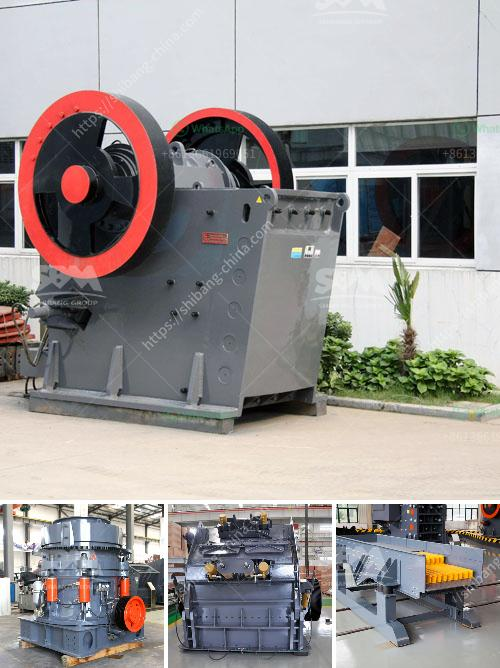

<h3>supplier of conveyor belt kenya</h3>
Conveyor belts are an essential component in various industries including mining, industrial, and manufacturing sectors. Conveyor belts play a crucial role in the efficient transportation of goods, materials, and products within different areas. The supplier of conveyor belts in Kenya works closely with the customers to provide a wide variety of options in the market.

Conveyor belts are manufactured using high-quality materials, ensuring optimal performance and durability. These belts are used to transport bulky materials efficiently, reducing labor intensity in various processes. They are also designed to withstand tough working conditions and are highly resistant to wear and tear. Conveyor belts can withstand harsh weather conditions, making them suitable for both indoor and outdoor applications.

One of the leading suppliers of conveyor belts in Kenya is Truco Enterprises. They have an extensive range of conveyor belts that cater to different industries such as mining, construction, agriculture, and food processing. Truco offers conveyor belts tailored to meet specific customer requirements and industry standards.

Truco Enterprises is known for its excellent customer service, ensuring that their clients' needs are met promptly. They have a dedicated team of experts who provide technical support and assistance in identifying the most suitable conveyor belt for specific applications. Truco's conveyor belts are manufactured using state-of-the-art technology, guaranteeing superior quality and reliability.

In addition to conveyor belts, Truco Enterprises provides a range of conveyor belt accessories to enhance the performance and longevity of the belts. These accessories include pulleys, idlers, and belt cleaners. The company also offers installation and maintenance services, ensuring that their customers' conveyor belts are always in optimal condition.

Another reputable supplier of conveyor belts in Kenya is E.A Belt Sales. With years of experience in the industry, E.A Belt Sales has gained a solid reputation for delivering high-quality conveyor belts and excellent customer service. They offer a wide range of conveyor belts that are suitable for various applications in different industries.

E.A Belt Sales prides itself on its efficient and reliable delivery services, ensuring that customers receive their conveyor belts in a timely manner. Their experienced team also provides installation, maintenance, and repair services to ensure the optimal performance of their conveyor belts.

When selecting a supplier for conveyor belts in Kenya, it is important to consider factors such as the supplier's reputation, product quality, customer service, and after-sales support. Truco Enterprises and E.A Belt Sales both stand out in these areas, making them reliable choices for businesses in Kenya.

In conclusion, the supplier of conveyor belts in Kenya plays a crucial role in the productivity and efficiency of industries. Truco Enterprises and E.A Belt Sales are two reputable suppliers known for their high-quality conveyor belts, excellent customer service, and comprehensive range of products. Whether it's for mining, construction, agriculture, or food processing, these suppliers have the expertise to provide suitable conveyor belts tailored to specific industry requirements.
<h3>Contact us</h3><ul><li><strong>Whatsapp:&nbsp;<a href="https://wa.me/8613661969651">+8613661969651</a></strong></li><li><a href="https://swt.shibang-china.com/?git&amp;zhl&amp;supplier of conveyor belt kenya"><strong>Online Service(chat now)</strong></a></li></ul><h3>Related</h3><ul><li><a href='vrm cement grinding.md'>vrm cement grinding</a></li><li><a href='lime stone crushing plant india.md'>lime stone crushing plant india</a></li><li><a href='cost of setting up a mini cement plant in india.md'>cost of setting up a mini cement plant in india</a></li><li><a href='calcium carbonate manufacturing machinery.md'>calcium carbonate manufacturing machinery</a></li><li><a href='malaysia used conveyor belt for sale.md'>malaysia used conveyor belt for sale</a></li></ul>